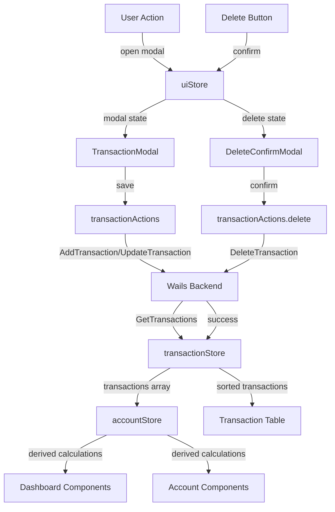

# App.svelte Refactoring Plan

## Executive Summary

This document outlines a comprehensive refactoring strategy for [`App.svelte`](../frontend/src/App.svelte:1) (503 lines), which currently handles too many responsibilities. The refactoring will break down the monolithic component into smaller, focused, reusable components while maintaining all existing functionality and the double-entry accounting accuracy.

**Current State:** Single 503-line component handling everything  
**Target State:** Modular architecture with 12+ focused components, 3 stores, and utility modules

---

## 1. Current Structure Analysis

### Responsibilities Breakdown

The current [`App.svelte`](../frontend/src/App.svelte:1) handles:

| Lines   | Responsibility                          | Complexity |
| ------- | --------------------------------------- | ---------- |
| 1-206   | All business logic, state, calculations | High       |
| 209-315 | Main UI layout and rendering            | Medium     |
| 317-405 | Modal components (transaction, delete)  | Medium     |
| 407-502 | All styling (96 lines)                  | Low        |

### Key Logic Areas

1. **Transaction CRUD** (lines 92-131, 74-85)
   - Create, update, delete operations
   - Wails backend integration
   - Success/error handling

2. **Account Path Resolution** (lines 98-116)
   - Complex logic for resolving account shortcuts
   - Creates full accounting paths from short names
   - Critical for double-entry accuracy

3. **Double-Entry Calculations** (lines 134-142)
   - Account balance computation
   - Reactive statement using reduce

4. **Dashboard Metrics** (lines 163-183)
   - Net worth, liquid cash, income, expenses
   - All computed reactively from transactions

5. **UI State Management** (lines 6-19, 36-67)
   - Modal visibility and modes
   - Form state
   - Delete confirmation state

6. **Autocomplete Generation** (lines 145-160)
   - Dynamic options based on existing accounts
   - Filtered by account type

---

## 2. Component Architecture

### Component Hierarchy

```
App.svelte (Root Container)
├── Header.svelte
│   ├── Logo/Title
│   └── ActionButtons.svelte
│       ├── RefreshButton
│       └── NewTransactionButton
│
├── Dashboard.svelte
│   └── MetricCard.svelte (×4)
│       ├── NetWorthCard
│       ├── LiquidCashCard
│       ├── IncomeCard
│       └── ExpensesCard
│
├── AccountsSection.svelte
│   ├── SectionHeader.svelte
│   └── AccountCard.svelte (×N)
│
├── TransactionsSection.svelte
│   ├── SectionHeader.svelte
│   └── TransactionTable.svelte
│       ├── TransactionTableHeader.svelte
│       └── TransactionRow.svelte (×N)
│
├── TransactionModal.svelte
│   ├── ModalBackdrop.svelte
│   ├── TransactionModeSelector.svelte
│   └── TransactionForm.svelte
│       ├── DateInput.svelte
│       ├── AccountInput.svelte (with autocomplete)
│       └── FormActions.svelte
│
├── DeleteConfirmModal.svelte
│   ├── ModalBackdrop.svelte
│   └── ConfirmDialog.svelte
│
└── EmptyState.svelte
```

### Component Responsibility Matrix

| Component                    | Single Responsibility            | Reusable? |
| ---------------------------- | -------------------------------- | --------- |
| `App.svelte`                 | Root orchestration, data loading | No        |
| `Header.svelte`              | Top navigation and actions       | Yes       |
| `Dashboard.svelte`           | Display 4 metric cards           | Yes       |
| `MetricCard.svelte`          | Display single metric            | Yes       |
| `AccountsSection.svelte`     | Display accounts grid            | Yes       |
| `AccountCard.svelte`         | Display single account           | Yes       |
| `TransactionsSection.svelte` | Transactions container           | Yes       |
| `TransactionTable.svelte`    | Table with rows                  | Yes       |
| `TransactionRow.svelte`      | Single transaction display       | Yes       |
| `TransactionModal.svelte`    | Transaction add/edit modal       | Yes       |
| `DeleteConfirmModal.svelte`  | Delete confirmation              | Yes       |
| `EmptyState.svelte`          | No data placeholder              | Yes       |

---

## 3. Store/State Management Strategy

### Store Architecture

Create 3 Svelte stores to manage shared state:

#### 3.1 `transactionStore.js`

**Purpose:** Manage transaction data and CRUD operations

```javascript
// Responsibilities:
- Store transactions array
- Load transactions from backend
- Add new transaction
- Update existing transaction
- Delete transaction
- Provide derived stores for sorted transactions
```

**API:**

```javascript
// Writable store
export const transactions = writable([]);

// Derived stores
export const sortedTransactions = derived(transactions, ($txs) =>
  [...$txs].sort((a, b) => new Date(b.date) - new Date(a.date)),
);

// Actions
export const transactionActions = {
  load: async () => {
    /* ... */
  },
  add: async (tx) => {
    /* ... */
  },
  update: async (tx) => {
    /* ... */
  },
  delete: async (id) => {
    /* ... */
  },
};
```

#### 3.2 `accountStore.js`

**Purpose:** Manage account balances and calculations

```javascript
// Responsibilities:
- Calculate account balances from transactions
- Provide account lists by type
- Generate autocomplete options
- Compute dashboard metrics
```

**API:**

```javascript
// Derived from transactions
export const accountBalances = derived(transactions, calculateBalances);

export const displayAccounts = derived(accountBalances, filterAndFormat);

export const walletOptions = derived(accountBalances, extractWallets);
export const expenseOptions = derived(accountBalances, extractExpenses);
export const incomeOptions = derived(accountBalances, extractIncome);

// Dashboard metrics
export const metrics = derived(accountBalances, calculateMetrics);
// Returns: { netWorth, liquidCash, totalIncome, totalExpenses }
```

#### 3.3 `uiStore.js`

**Purpose:** Manage UI state (modals, forms)

```javascript
// Responsibilities:
- Modal visibility state
- Modal mode (add/edit)
- Form state for transaction modal
- Delete confirmation state
```

**API:**

```javascript
export const modalState = writable({
  showTransactionModal: false,
  modalMode: "add", // 'add' | 'edit'
  editingTransaction: null,
  showDeleteConfirm: false,
  deleteTargetId: null,
});

export const formState = writable({
  txMode: "expense", // 'expense' | 'income' | 'transfer'
  uiWallet: "",
  uiCategory: "",
  transaction: getEmptyTransaction(),
});

// Actions
export const uiActions = {
  openAddModal: () => {
    /* ... */
  },
  openEditModal: (tx) => {
    /* ... */
  },
  closeModal: () => {
    /* ... */
  },
  confirmDelete: (id) => {
    /* ... */
  },
  cancelDelete: () => {
    /* ... */
  },
};
```

### State Flow Diagram



---

## 4. Utility Functions

### 4.1 `accountUtils.js`

**Purpose:** Account path resolution and manipulation

```javascript
/**
 * Resolves a short account name to full accounting path
 * @param {string} shortName - User input (e.g., "PagBank")
 * @param {string} defaultPrefix - Fallback prefix (e.g., "Assets:Liquid")
 * @param {string[]} existingAccounts - All account names
 * @returns {string} Full path (e.g., "Assets:Liquid:PagBank")
 */
export function resolveAccountPath(shortName, defaultPrefix, existingAccounts) {
  const cleanName = shortName.trim();
  const existing = existingAccounts.find(
    (a) => a.split(":").pop().toLowerCase() === cleanName.toLowerCase(),
  );
  return existing || `${defaultPrefix}:${cleanName.replace(/\s+/g, "")}`;
}

/**
 * Extracts short name from full account path
 * @param {string} fullPath - Full path (e.g., "Assets:Liquid:PagBank")
 * @returns {string} Short name (e.g., "PagBank")
 */
export function getShortName(fullPath) {
  return fullPath.split(":").pop();
}

/**
 * Gets account type from full path
 * @param {string} fullPath - Full path
 * @returns {string} Type (e.g., "Liquid", "Fixed", "Debt")
 */
export function getAccountType(fullPath) {
  return fullPath.split(":")[1] || "Other";
}

/**
 * Filters accounts by prefix
 * @param {string[]} accounts - All account names
 * @param {string} prefix - Prefix to filter by
 * @returns {string[]} Filtered accounts
 */
export function filterAccountsByPrefix(accounts, prefix) {
  return accounts.filter((a) => a.startsWith(prefix));
}
```

### 4.2 `calculationUtils.js`

**Purpose:** Double-entry accounting calculations

```javascript
/**
 * Calculates account balances using double-entry accounting
 * @param {Transaction[]} transactions - All transactions
 * @returns {Object} Map of account name to balance
 */
export function calculateAccountBalances(transactions) {
  return transactions.reduce((acc, tx) => {
    if (!acc[tx.destination]) acc[tx.destination] = 0;
    acc[tx.destination] += tx.amount;

    if (!acc[tx.source]) acc[tx.source] = 0;
    acc[tx.source] -= tx.amount;

    return acc;
  }, {});
}

/**
 * Calculates dashboard metrics
 * @param {Object} accountBalances - Account balances map
 * @param {Transaction[]} transactions - All transactions
 * @returns {Object} Metrics object
 */
export function calculateMetrics(accountBalances, transactions) {
  const liquidCash = Object.entries(accountBalances)
    .filter(([name]) => name.startsWith("Assets:Liquid"))
    .reduce((sum, [_, bal]) => sum + bal, 0);

  const totalAssets = Object.entries(accountBalances)
    .filter(([name]) => name.startsWith("Assets"))
    .reduce((sum, [_, bal]) => sum + bal, 0);

  const totalLiabilities = Object.entries(accountBalances)
    .filter(([name]) => name.startsWith("Liabilities"))
    .reduce((sum, [_, bal]) => sum + bal, 0);

  const netWorth = totalAssets + totalLiabilities;

  const totalIncome = transactions
    .filter((t) => t.source.startsWith("Income"))
    .reduce((sum, t) => sum + t.amount, 0);

  const totalExpenses = transactions
    .filter((t) => t.destination.startsWith("Expenses"))
    .reduce((sum, t) => sum + t.amount, 0);

  return { netWorth, liquidCash, totalIncome, totalExpenses };
}

/**
 * Formats display accounts from balances
 * @param {Object} accountBalances - Account balances map
 * @returns {Array} Formatted account objects
 */
export function formatDisplayAccounts(accountBalances) {
  return Object.entries(accountBalances)
    .filter(
      ([name]) => name.startsWith("Assets") || name.startsWith("Liabilities"),
    )
    .map(([name, balance]) => ({
      fullName: name,
      shortName: getShortName(name),
      type: getAccountType(name),
      balance,
    }))
    .filter((acc) => Math.abs(acc.balance) > 0.01)
    .sort((a, b) => a.fullName.localeCompare(b.fullName));
}
```

### 4.3 `transactionUtils.js`

**Purpose:** Transaction manipulation and validation

```javascript
/**
 * Creates empty transaction object with defaults
 * @returns {Transaction} Empty transaction
 */
export function getEmptyTransaction() {
  const today = new Date().toISOString().split("T")[0];
  return {
    id: "",
    date: today,
    source: "",
    destination: "",
    amount: 0,
    description: "",
    currency: "BRL",
    tags: "",
    status: "completed",
  };
}

/**
 * Determines transaction mode from source/destination
 * @param {Transaction} tx - Transaction object
 * @returns {Object} Mode info { mode, wallet, category }
 */
export function determineTransactionMode(tx) {
  if (tx.source.startsWith("Income")) {
    return {
      mode: "income",
      category: tx.source.split(":").pop(),
      wallet: tx.destination.split(":").pop(),
    };
  } else if (tx.destination.startsWith("Expenses")) {
    return {
      mode: "expense",
      wallet: tx.source.split(":").pop(),
      category: tx.destination.split(":").pop(),
    };
  } else {
    return {
      mode: "transfer",
      wallet: tx.source.split(":").pop(),
      category: tx.destination.split(":").pop(),
    };
  }
}

/**
 * Builds transaction from form data
 * @param {Object} formData - Form state
 * @param {string[]} existingAccounts - All account names
 * @returns {Transaction} Complete transaction object
 */
export function buildTransaction(formData, existingAccounts) {
  const { txMode, uiWallet, uiCategory, transaction } = formData;
  const tx = { ...transaction };

  // Ensure amount is a number
  if (typeof tx.amount === "string") {
    tx.amount = parseFloat(tx.amount);
  }

  // Resolve accounts based on mode
  if (txMode === "expense") {
    tx.source = resolveAccountPath(uiWallet, "Assets:Liquid", existingAccounts);
    tx.destination = resolveAccountPath(
      uiCategory,
      "Expenses",
      existingAccounts,
    );
  } else if (txMode === "income") {
    tx.source = resolveAccountPath(uiCategory, "Income", existingAccounts);
    tx.destination = resolveAccountPath(
      uiWallet,
      "Assets:Liquid",
      existingAccounts,
    );
  } else if (txMode === "transfer") {
    tx.source = resolveAccountPath(uiWallet, "Assets:Liquid", existingAccounts);
    tx.destination = resolveAccountPath(
      uiCategory,
      "Assets:Liquid",
      existingAccounts,
    );
  }

  return tx;
}
```

### 4.4 `formatUtils.js`

**Purpose:** Formatting and display helpers

```javascript
/**
 * Formats currency value
 * @param {number} value - Numeric value
 * @param {string} currency - Currency code
 * @returns {string} Formatted string
 */
export function formatCurrency(value, currency = "BRL") {
  return `R$ ${value.toFixed(2)}`;
}

/**
 * Formats date for display
 * @param {string} dateString - ISO date string
 * @returns {string} Formatted date
 */
export function formatDate(dateString) {
  return dateString; // Can be enhanced with locale formatting
}
```

---

## 5. File Structure

### Proposed Directory Tree

```
frontend/src/
├── App.svelte                          # Root component (simplified to ~100 lines)
├── main.js
├── style.css                           # Global styles only
├── vite-env.d.ts
│
├── components/                         # UI Components
│   ├── layout/
│   │   ├── Header.svelte              # App header with title and actions
│   │   ├── SectionHeader.svelte       # Reusable section header
│   │   └── EmptyState.svelte          # No data placeholder
│   │
│   ├── dashboard/
│   │   ├── Dashboard.svelte           # Dashboard container
│   │   └── MetricCard.svelte          # Individual metric card
│   │
│   ├── accounts/
│   │   ├── AccountsSection.svelte     # Accounts container
│   │   └── AccountCard.svelte         # Individual account card
│   │
│   ├── transactions/
│   │   ├── TransactionsSection.svelte # Transactions container
│   │   ├── TransactionTable.svelte    # Table component
│   │   └── TransactionRow.svelte      # Table row component
│   │
│   ├── modals/
│   │   ├── ModalBackdrop.svelte       # Reusable backdrop
│   │   ├── TransactionModal.svelte    # Add/Edit transaction modal
│   │   ├── TransactionForm.svelte     # Form within modal
│   │   ├── TransactionModeSelector.svelte # Expense/Income/Transfer tabs
│   │   └── DeleteConfirmModal.svelte  # Delete confirmation
│   │
│   └── common/
│       ├── Button.svelte              # Reusable button component
│       ├── Input.svelte               # Reusable input with label
│       └── AutocompleteInput.svelte   # Input with datalist
│
├── stores/                             # Svelte Stores
│   ├── transactionStore.js            # Transaction data and CRUD
│   ├── accountStore.js                # Account balances and metrics
│   └── uiStore.js                     # UI state (modals, forms)
│
├── utils/                              # Pure Functions
│   ├── accountUtils.js                # Account path resolution
│   ├── calculationUtils.js            # Double-entry calculations
│   ├── transactionUtils.js            # Transaction helpers
│   └── formatUtils.js                 # Formatting helpers
│
├── styles/                             # Shared Styles
│   ├── variables.css                  # CSS custom properties (colors, spacing)
│   ├── buttons.css                    # Button styles
│   ├── cards.css                      # Card styles
│   ├── forms.css                      # Form styles
│   ├── modals.css                     # Modal styles
│   └── tables.css                     # Table styles
│
└── assets/                             # Static Assets
    ├── fonts/
    └── images/
```

### File Count Summary

- **Before:** 1 file (503 lines)
- **After:** ~30 files
  - Components: 18 files
  - Stores: 3 files
  - Utils: 4 files
  - Styles: 6 files (optional, can stay in components)

---

## 6. Migration Strategy

### Phase-Based Approach

#### Phase 1: Foundation (Low Risk)

**Goal:** Extract utilities and stores without touching UI

1. ✅ Create utility modules
   - `utils/accountUtils.js`
   - `utils/calculationUtils.js`
   - `utils/transactionUtils.js`
   - `utils/formatUtils.js`

2. ✅ Create stores
   - `stores/transactionStore.js`
   - `stores/accountStore.js`
   - `stores/uiStore.js`

3. ✅ Update `App.svelte` to use stores and utils
   - Replace inline logic with utility functions
   - Replace local state with store subscriptions
   - **Test:** All functionality still works

**Risk Level:** Low  
**Testing:** Manual testing of all CRUD operations

---

#### Phase 2: Extract Leaf Components (Low-Medium Risk)

**Goal:** Extract simple, presentational components

4. ✅ Extract simple components (no complex logic)
   - `components/common/Button.svelte`
   - `components/common/Input.svelte`
   - `components/layout/SectionHeader.svelte`
   - `components/layout/EmptyState.svelte`
   - `components/dashboard/MetricCard.svelte`
   - `components/accounts/AccountCard.svelte`

5. ✅ Update `App.svelte` to use new components
   - **Test:** Visual regression, all displays correct

**Risk Level:** Low-Medium  
**Testing:** Visual inspection, manual testing

---

#### Phase 3: Extract Container Components (Medium Risk)

**Goal:** Extract components that compose other components

6. ✅ Extract container components
   - `components/layout/Header.svelte`
   - `components/dashboard/Dashboard.svelte`
   - `components/accounts/AccountsSection.svelte`

7. ✅ Update `App.svelte` to use containers
   - **Test:** All sections render correctly

**Risk Level:** Medium  
**Testing:** Full manual test of all features

---

#### Phase 4: Extract Transaction Components (Medium-High Risk)

**Goal:** Extract transaction table and row components

8. ✅ Extract transaction components
   - `components/transactions/TransactionRow.svelte`
   - `components/transactions/TransactionTable.svelte`
   - `components/transactions/TransactionsSection.svelte`

9. ✅ Update `App.svelte` to use transaction components
   - **Test:** Table sorting, row clicks, edit/delete actions

**Risk Level:** Medium-High  
**Testing:** Test all transaction interactions

---

#### Phase 5: Extract Modal Components (High Risk)

**Goal:** Extract complex modal components with forms

10. ✅ Extract modal components
    - `components/modals/ModalBackdrop.svelte`
    - `components/modals/TransactionModeSelector.svelte`
    - `components/modals/TransactionForm.svelte`
    - `components/modals/TransactionModal.svelte`
    - `components/modals/DeleteConfirmModal.svelte`

11. ✅ Update `App.svelte` to use modals
    - **Test:** Add transaction, edit transaction, delete transaction
    - **Test:** Account path resolution still works correctly
    - **Test:** Autocomplete options populate correctly

**Risk Level:** High  
**Testing:** Comprehensive testing of all CRUD operations

---

#### Phase 6: Finalization (Low Risk)

**Goal:** Clean up and optimize

12. ✅ Extract styles to separate files (optional)
    - Move shared styles to `styles/` directory
    - Keep component-specific styles in components

13. ✅ Final cleanup
    - Remove unused code
    - Add JSDoc comments
    - Update imports

14. ✅ Final testing
    - Full regression test
    - Test double-entry calculations accuracy
    - Test all edge cases

**Risk Level:** Low  
**Testing:** Full regression test suite

---

### Migration Order Rationale

1. **Utilities First:** No UI changes, easy to test
2. **Stores Second:** Centralizes state, easier to debug
3. **Leaf Components:** Simple, no dependencies
4. **Containers:** Compose leaf components
5. **Complex Components:** Transaction table and modals last
6. **Styles:** Optional, can be done anytime

### Rollback Strategy

- Keep original `App.svelte` as `App.svelte.backup`
- Commit after each phase
- If issues arise, revert to previous phase
- Use feature flags if needed for gradual rollout

---

## 7. Component Specifications

### 7.1 Root Component

#### `App.svelte`

**File:** `frontend/src/App.svelte`

**Responsibility:** Root orchestration, data loading, component composition

**Props:** None (root component)

**Events:** None (root component)

**Internal State:**

```javascript
// None - all state moved to stores
```

**Dependencies:**

```javascript
import { onMount } from "svelte";
import { transactionActions } from "./stores/transactionStore.js";
import { transactions } from "./stores/transactionStore.js";
import Header from "./components/layout/Header.svelte";
import Dashboard from "./components/dashboard/Dashboard.svelte";
import AccountsSection from "./components/accounts/AccountsSection.svelte";
import TransactionsSection from "./components/transactions/TransactionsSection.svelte";
import TransactionModal from "./components/modals/TransactionModal.svelte";
import DeleteConfirmModal from "./components/modals/DeleteConfirmModal.svelte";
import EmptyState from "./components/layout/EmptyState.svelte";
```

**Simplified Structure (~100 lines):**

```svelte
<script>
  // Imports
  // Subscribe to stores
  // Load data on mount
</script>

<main class="container">
  <Header />

  {#if $transactions.length > 0}
    <Dashboard />
    <AccountsSection />
    <TransactionsSection />
  {:else}
    <EmptyState />
  {/if}
</main>

<TransactionModal />
<DeleteConfirmModal />

<style>
  /* Minimal container styles only */
</style>
```

---

### 7.2 Layout Components

#### `Header.svelte`

**File:** `frontend/src/components/layout/Header.svelte`

**Responsibility:** Display app title and action buttons

**Props:** None

**Events:**

- `refresh` - Emitted when refresh button clicked
- `newTransaction` - Emitted when new transaction button clicked

**Internal State:** None

**Dependencies:**

```javascript
import { createEventDispatcher } from "svelte";
import Button from "../common/Button.svelte";
```

**Structure:**

```svelte
<header>
  <h1>💎 Geode Vault</h1>
  <div class="actions">
    <Button variant="secondary" on:click={() => dispatch('refresh')}>
      Refresh
    </Button>
    <Button variant="primary" on:click={() => dispatch('newTransaction')}>
      + New Transaction
    </Button>
  </div>
</header>
```

---

#### `SectionHeader.svelte`

**File:** `frontend/src/components/layout/SectionHeader.svelte`

**Responsibility:** Display section title with consistent styling

**Props:**

```javascript
export let title; // string - Section title
```

**Events:** None

**Internal State:** None

**Dependencies:** None

**Structure:**

```svelte
<div class="section-header">
  <h2>{title}</h2>
</div>
```

---

#### `EmptyState.svelte`

**File:** `frontend/src/components/layout/EmptyState.svelte`

**Responsibility:** Display message when no transactions exist

**Props:** None

**Events:** None

**Internal State:** None

**Dependencies:** None

**Structure:**

```svelte
<div class="empty-state">
  <h2>Welcome to your Geode.</h2>
  <p>Please place your master <code>geode.csv</code> inside the vault folder or create a new transaction.</p>
</div>
```

---

### 7.3 Dashboard Components

#### `Dashboard.svelte`

**File:** `frontend/src/components/dashboard/Dashboard.svelte`

**Responsibility:** Display 4 metric cards in a grid

**Props:** None (reads from store)

**Events:** None

**Internal State:** None

**Dependencies:**

```javascript
import { metrics } from "../../stores/accountStore.js";
import MetricCard from "./MetricCard.svelte";
```

**Structure:**

```svelte
<div class="dashboard grid-4">
  <MetricCard
    title="Total Net Worth"
    value={$metrics.netWorth}
    variant="core"
  />
  <MetricCard
    title="Liquid Cash"
    value={$metrics.liquidCash}
    variant="cash"
  />
  <MetricCard
    title="Total Income"
    value={$metrics.totalIncome}
    variant="income"
  />
  <MetricCard
    title="Total Expenses"
    value={$metrics.totalExpenses}
    variant="expenses"
  />
</div>
```

---

#### `MetricCard.svelte`

**File:** `frontend/src/components/dashboard/MetricCard.svelte`

**Responsibility:** Display single metric with title and value

**Props:**

```javascript
export let title; // string - Metric title
export let value; // number - Metric value
export let variant; // 'core' | 'cash' | 'income' | 'expenses'
export let currency = "BRL"; // string - Currency code
```

**Events:** None

**Internal State:** None

**Dependencies:**

```javascript
import { formatCurrency } from "../../utils/formatUtils.js";
```

**Structure:**

```svelte
<div class="card {variant}">
  <h3>{title}</h3>
  <p>{formatCurrency(value, currency)}</p>
</div>
```

---

### 7.4 Account Components

#### `AccountsSection.svelte`

**File:** `frontend/src/components/accounts/AccountsSection.svelte`

**Responsibility:** Display accounts section with header and cards

**Props:** None (reads from store)

**Events:** None

**Internal State:** None

**Dependencies:**

```javascript
import { displayAccounts } from "../../stores/accountStore.js";
import SectionHeader from "../layout/SectionHeader.svelte";
import AccountCard from "./AccountCard.svelte";
```

**Structure:**

```svelte
<SectionHeader title="Assets & Liabilities" />
<div class="accounts-row">
  {#each $displayAccounts as account}
    <AccountCard {account} />
  {/each}
</div>
```

---

#### `AccountCard.svelte`

**File:** `frontend/src/components/accounts/AccountCard.svelte`

**Responsibility:** Display single account with type, name, and balance

**Props:**

```javascript
export let account; // { fullName, shortName, type, balance }
```

**Events:** None

**Internal State:** None

**Dependencies:**

```javascript
import { formatCurrency } from "../../utils/formatUtils.js";
```

**Structure:**

```svelte
<div class="account-card {account.fullName.startsWith('Liabilities') ? 'liability' : ''}">
  <div class="acc-details">
    <span class="acc-type {account.type.toLowerCase()}">{account.type}</span>
    <h4>{account.shortName}</h4>
    <p class={account.balance < 0 ? 'negative' : 'positive'}>
      {formatCurrency(account.balance)}
    </p>
  </div>
</div>
```

---

### 7.5 Transaction Components

#### `TransactionsSection.svelte`

**File:** `frontend/src/components/transactions/TransactionsSection.svelte`

**Responsibility:** Display transactions section with header and table

**Props:** None (reads from store)

**Events:** None

**Internal State:** None

**Dependencies:**

```javascript
import SectionHeader from "../layout/SectionHeader.svelte";
import TransactionTable from "./TransactionTable.svelte";
```

**Structure:**

```svelte
<SectionHeader title="General Ledger" />
<div class="table-container">
  <TransactionTable />
</div>
```

---

#### `TransactionTable.svelte`

**File:** `frontend/src/components/transactions/TransactionTable.svelte`

**Responsibility:** Display transaction table with header and rows

**Props:** None (reads from store)

**Events:**

- `edit` - Emitted when edit button clicked, passes transaction
- `delete` - Emitted when delete button clicked, passes transaction id

**Internal State:** None

**Dependencies:**

```javascript
import { sortedTransactions } from "../../stores/transactionStore.js";
import TransactionRow from "./TransactionRow.svelte";
```

**Structure:**

```svelte
<table>
  <thead>
    <tr>
      <th>Date</th>
      <th>Flow (Source ➔ Destination)</th>
      <th>Description</th>
      <th>Amount</th>
      <th>Tags</th>
      <th class="actions-col">Actions</th>
    </tr>
  </thead>
  <tbody>
    {#each $sortedTransactions as tx}
      <TransactionRow
        transaction={tx}
        on:edit
        on:delete
      />
    {/each}
  </tbody>
</table>
```

---

#### `TransactionRow.svelte`

**File:** `frontend/src/components/transactions/TransactionRow.svelte`

**Responsibility:** Display single transaction row with actions

**Props:**

```javascript
export let transaction; // Transaction object
```

**Events:**

- `edit` - Emitted when row or edit button clicked
- `delete` - Emitted when delete button clicked

**Internal State:** None

**Dependencies:**

```javascript
import { createEventDispatcher } from "svelte";
import { getShortName } from "../../utils/accountUtils.js";
import { formatCurrency } from "../../utils/formatUtils.js";
```

**Structure:**

```svelte
<tr class="transaction-row" on:click={() => dispatch('edit', transaction)}>
  <td class="date-col">{transaction.date}</td>
  <td class="flow-col">
    <span class="pill source">{getShortName(transaction.source)}</span>
    <span class="arrow">➔</span>
    <span class="pill dest">{getShortName(transaction.destination)}</span>
  </td>
  <td>{transaction.description}</td>
  <td class="amount-col">
    <strong>{formatCurrency(transaction.amount, transaction.currency)}</strong>
  </td>
  <td>
    {#if transaction.tags}
      <span class="tag">{transaction.tags}</span>
    {/if}
  </td>
  <td class="actions-col">
    <button
      class="btn-icon edit"
      on:click|stopPropagation={() => dispatch('edit', transaction)}
      title="Edit transaction"
    >
      ✏️
    </button>
    <button
      class="btn-icon delete"
      on:click|stopPropagation={() => dispatch('delete', transaction.id)}
      title="Delete transaction"
    >
      🗑️
    </button>
  </td>
</tr>
```

---

### 7.6 Modal Components

#### `TransactionModal.svelte`

**File:** `frontend/src/components/modals/TransactionModal.svelte`

**Responsibility:** Modal container for adding/editing transactions

**Props:** None (reads from store)

**Events:** None (uses store actions)

**Internal State:** None

**Dependencies:**

```javascript
import { modalState, formState, uiActions } from "../../stores/uiStore.js";
import { transactionActions } from "../../stores/transactionStore.js";
import { allAccountNames } from "../../stores/accountStore.js";
import ModalBackdrop from "./ModalBackdrop.svelte";
import TransactionModeSelector from "./TransactionModeSelector.svelte";
import TransactionForm from "./TransactionForm.svelte";
import { buildTransaction } from "../../utils/transactionUtils.js";
```

**Structure:**

```svelte
{#if $modalState.showTransactionModal}
  <ModalBackdrop on:close={uiActions.closeModal}>
    <div class="modal">
      <h2>{$modalState.modalMode === 'edit' ? 'Edit Transaction' : 'Add Transaction'}</h2>

      <TransactionModeSelector />
      <TransactionForm on:save={handleSave} on:cancel={uiActions.closeModal} />
    </div>
  </ModalBackdrop>
{/if}

<script>
  async function handleSave() {
    const tx = buildTransaction($formState, $allAccountNames);

    let success;
    if ($modalState.modalMode === 'edit') {
      success = await transactionActions.update(tx);
    } else {
      success = await transactionActions.add(tx);
    }

    if (success) {
      uiActions.closeModal();
    } else {
      alert(`Failed to ${$modalState.modalMode === 'edit' ? 'update' : 'save'} transaction!`);
    }
  }
</script>
```

---

#### `ModalBackdrop.svelte`

**File:** `frontend/src/components/modals/ModalBackdrop.svelte`

**Responsibility:** Reusable modal backdrop with click-outside-to-close

**Props:**

```javascript
export let closeOnBackdropClick = true; // boolean
```

**Events:**

- `close` - Emitted when backdrop clicked or Escape pressed

**Internal State:** None

**Dependencies:**

```javascript
import { createEventDispatcher } from "svelte";
```

**Structure:**

```svelte
<div
  class="modal-backdrop"
  role="dialog"
  tabindex="-1"
  on:click|self={() => closeOnBackdropClick && dispatch('close')}
  on:keydown={(e) => { if (e.key === 'Escape') dispatch('close'); }}
>
  <slot />
</div>
```

---

#### `TransactionModeSelector.svelte`

**File:** `frontend/src/components/modals/TransactionModeSelector.svelte`

**Responsibility:** Tab selector for expense/income/transfer modes

**Props:** None (reads from store)

**Events:** None (updates store directly)

**Internal State:** None

**Dependencies:**

```javascript
import { formState } from "../../stores/uiStore.js";
```

**Structure:**

```svelte
<div class="tabs">
  <button
    class:active={$formState.txMode === 'expense'}
    on:click={() => formState.update(s => ({ ...s, txMode: 'expense' }))}
  >
    Expense
  </button>
  <button
    class:active={$formState.txMode === 'income'}
    on:click={() => formState.update(s => ({ ...s, txMode: 'income' }))}
  >
    Income
  </button>
  <button
    class:active={$formState.txMode === 'transfer'}
    on:click={() => formState.update(s => ({ ...s, txMode: 'transfer' }))}
  >
    Transfer
  </button>
</div>
```

---

#### `TransactionForm.svelte`

**File:** `frontend/src/components/modals/TransactionForm.svelte`

**Responsibility:** Form fields for transaction data entry

**Props:** None (reads from store)

**Events:**

- `save` - Emitted when save button clicked
- `cancel` - Emitted when cancel button clicked

**Internal State:** None

**Dependencies:**

```javascript
import { createEventDispatcher } from "svelte";
import { formState } from "../../stores/uiStore.js";
import {
  walletOptions,
  expenseOptions,
  incomeOptions,
} from "../../stores/accountStore.js";
import AutocompleteInput from "../common/AutocompleteInput.svelte";
import Input from "../common/Input.svelte";
import Button from "../common/Button.svelte";
```

**Structure:**

```svelte
<form on:submit|preventDefault={() => dispatch('save')}>
  <Input
    label="Date"
    type="date"
    bind:value={$formState.transaction.date}
  />

  <div class="form-group row">
    <AutocompleteInput
      label={$formState.txMode === 'transfer' ? 'From Account' : 'Account'}
      options={$walletOptions}
      bind:value={$formState.uiWallet}
      placeholder="e.g. PagBank"
    />
    <AutocompleteInput
      label={$formState.txMode === 'transfer' ? 'To Account' : 'Category'}
      options={currentCategoryOptions}
      bind:value={$formState.uiCategory}
      placeholder={$formState.txMode === 'expense' ? 'e.g. Mercado' : 'e.g. Salario'}
    />
  </div>

  <div class="form-group row">
    <Input
      label="Amount"
      type="number"
      step="0.01"
      bind:value={$formState.transaction.amount}
    />
    <Input
      label="Currency"
      type="text"
      bind:value={$formState.transaction.currency}
    />
  </div>

  <Input
    label="Description"
    type="text"
    bind:value={$formState.transaction.description}
    placeholder="e.g. Compras no supermercado"
  />

  <Input
    label="Tags (Optional)"
    type="text"
    bind:value={$formState.transaction.tags}
    placeholder="e.g. #viagem"
  />

  <div class="modal-actions">
    <Button variant="secondary" on:click={() => dispatch('cancel')}>
      Cancel
    </Button>
    <Button variant="primary" type="submit">
      {$modalState.modalMode === 'edit' ? 'Update' : 'Save Transaction'}
    </Button>
  </div>
</form>

<script>
  $: currentCategoryOptions = $formState.txMode === 'expense'
    ? $expenseOptions
    : ($formState.txMode === 'income' ? $incomeOptions : $walletOptions);
</script>
```

---

#### `DeleteConfirmModal.svelte`

**File:** `frontend/src/components/modals/DeleteConfirmModal.svelte`

**Responsibility:** Confirmation dialog for deleting transactions

**Props:** None (reads from store)

**Events:** None (uses store actions)

**Internal State:** None

**Dependencies:**

```javascript
import { modalState, uiActions } from "../../stores/uiStore.js";
import { transactionActions } from "../../stores/transactionStore.js";
import ModalBackdrop from "./ModalBackdrop.svelte";
import Button from "../common/Button.svelte";
```

**Structure:**

```svelte
{#if $modalState.showDeleteConfirm}
  <ModalBackdrop on:close={uiActions.cancelDelete}>
    <div class="modal confirm-dialog">
      <h2>⚠️ Confirm Delete</h2>
      <p>Are you sure you want to delete this transaction? This action cannot be undone.</p>
      <div class="modal-actions">
        <Button variant="secondary" on:click={uiActions.cancelDelete}>
          Cancel
        </Button>
        <Button variant="danger" on:click={handleDelete}>
          Delete
        </Button>
      </div>
    </div>
  </ModalBackdrop>
{/if}

<script>
  async function handleDelete() {
    const success = await transactionActions.delete($modalState.deleteTargetId);
    if (success) {
      uiActions.cancelDelete();
    } else {
      alert("Failed to delete transaction!");
    }
  }
</script>
```

---

### 7.7 Common/Reusable Components

#### `Button.svelte`

**File:** `frontend/src/components/common/Button.svelte`

**Responsibility:** Reusable button with variants

**Props:**

```javascript
export let variant = "primary"; // 'primary' | 'secondary' | 'danger'
export let type = "button"; // 'button' | 'submit'
export let disabled = false; // boolean
```

**Events:**

- `click` - Forwarded from native button

**Internal State:** None

**Dependencies:** None

**Structure:**

```svelte
<button
  class="btn btn-{variant}"
  {type}
  {disabled}
  on:click
>
  <slot />
</button>
```

---

#### `Input.svelte`

**File:** `frontend/src/components/common/Input.svelte`

**Responsibility:** Reusable input field with label

**Props:**

```javascript
export let label; // string
export let type = "text"; // string
export let value; // string | number
export let placeholder = ""; // string
export let step = undefined; // number (for type="number")
export let id = undefined; // string
```

**Events:**

- Two-way binding via `bind:value`

**Internal State:** None

**Dependencies:** None

**Structure:**

```svelte
<div class="form-group">
  <label for={id}>{label}</label>
  <input
    {id}
    {type}
    {placeholder}
    {step}
    bind:value
  />
</div>
```

---

#### `AutocompleteInput.svelte`

**File:** `frontend/src/components/common/AutocompleteInput.svelte`

**Responsibility:** Input field with datalist autocomplete

**Props:**

```javascript
export let label; // string
export let value; // string
export let options = []; // string[]
export let placeholder = ""; // string
export let id = undefined; // string
```

**Events:**

- Two-way binding via `bind:value`

**Internal State:**

```javascript
const listId = id
  ? `${id}-list`
  : `list-${Math.random().toString(36).substr(2, 9)}`;
```

**Dependencies:** None

**Structure:**

```svelte
<div class="form-group">
  <label for={id}>{label}</label>
  <input
    {id}
    type="text"
    list={listId}
    {placeholder}
    bind:value
    autocomplete="off"
  />
  <datalist id={listId}>
    {#each options as option}
      <option value={option}></option>
    {/each}
  </datalist>
</div>
```

---

## 8. Testing Strategy

### 8.1 Testing Approach During Refactoring

Since this is a Wails desktop application without a formal test suite, testing will be manual but systematic.

#### Test Checklist Per Phase

**Phase 1: Foundation (Utilities & Stores)**

- [ ] All transactions load correctly
- [ ] Account balances calculate correctly
- [ ] Dashboard metrics display correct values
- [ ] No console errors

**Phase 2: Leaf Components**

- [ ] All UI elements render correctly
- [ ] Styling matches original
- [ ] No visual regressions
- [ ] Buttons are clickable

**Phase 3: Container Components**

- [ ] Dashboard displays 4 cards
- [ ] Accounts section displays all accounts
- [ ] Header displays correctly
- [ ] All sections have proper spacing

**Phase 4: Transaction Components**

- [ ] Transaction table displays all transactions
- [ ] Transactions sorted by date (newest first)
- [ ] Click on row opens edit modal
- [ ] Edit button opens edit modal
- [ ] Delete button shows confirmation

**Phase 5: Modal Components**

- [ ] Click "New Transaction" opens modal
- [ ] Modal displays correct mode (add/edit)
- [ ] Tab switching works (expense/income/transfer)
- [ ] Autocomplete shows correct options
- [ ] Save creates/updates transaction correctly
- [ ] Account path resolution works correctly
- [ ] Cancel closes modal
- [ ] Click outside closes modal
- [ ] Escape key closes modal
- [ ] Delete confirmation works
- [ ] Delete actually deletes transaction

**Phase 6: Final Testing**

- [ ] Full regression test of all features
- [ ] Test with empty database
- [ ] Test with large dataset (100+ transactions)
- [ ] Test all edge cases:
  - [ ] New account creation via shortcut
  - [ ] Existing account selection
  - [ ] Transfer between accounts
  - [ ] Negative balances display correctly
  - [ ] Zero balances filtered out
  - [ ] Special characters in descriptions
  - [ ] Very long account names
  - [ ] Very large amounts

### 8.2 Critical Test Cases

#### Double-Entry Accounting Accuracy

```
Test: Create expense transaction
- Source: Assets:Liquid:PagBank
- Destination: Expenses:Mercado
- Amount: 100.00
Expected:
- PagBank balance decreases by 100.00
- Mercado balance increases by 100.00
- Total expenses increases by 100.00
```

```
Test: Create income transaction
- Source: Income:Salario
- Destination: Assets:Liquid:PagBank
- Amount: 5000.00
Expected:
- Salario balance decreases by 5000.00 (income is negative)
- PagBank balance increases by 5000.00
- Total income increases by 5000.00
```

```
Test: Create transfer transaction
- Source: Assets:Liquid:PagBank
- Destination: Assets:Fixed:Investimentos
- Amount: 1000.00
Expected:
- PagBank balance decreases by 1000.00
- Investimentos balance increases by 1000.00
- Net worth unchanged
```

#### Account Path Resolution

```
Test: New account via shortcut
Input: "NovoWallet" (doesn't exist)
Expected: Creates "Assets:Liquid:NovoWallet"

Test: Existing account via shortcut
Input: "PagBank" (exists as "Assets:Liquid:PagBank")
Expected: Resolves to "Assets:Liquid:PagBank"

Test: Case insensitive matching
Input: "pagbank" (lowercase)
Expected: Resolves to "Assets:Liquid:PagBank"
```

### 8.3 Performance Considerations

- **Large Datasets:** Test with 1000+ transactions
- **Reactive Calculations:** Ensure no performance degradation
- **Memory Leaks:** Check for proper cleanup of subscriptions
- **Render Performance:** Table should render smoothly

---

## 9. Risk Assessment & Mitigation

### High-Risk Areas

#### 9.1 Account Path Resolution Logic

**Risk Level:** 🔴 HIGH

**Why:** Complex logic that's critical for data integrity. If broken, could create duplicate accounts or lose data.

**Mitigation:**

- Extract to utility function first
- Write comprehensive test cases
- Test with existing data before refactoring UI
- Keep original logic commented in code for reference
- Test case-insensitive matching thoroughly

#### 9.2 Double-Entry Calculations

**Risk Level:** 🔴 HIGH

**Why:** Core accounting logic. Errors could lead to incorrect balances.

**Mitigation:**

- Extract calculation logic to pure functions
- Test with known datasets
- Verify totals match before and after refactoring
- Use immutable data patterns
- Add validation checks

#### 9.3 Modal State Management

**Risk Level:** 🟡 MEDIUM

**Why:** Complex state transitions between add/edit modes. Could lead to data loss or incorrect updates.

**Mitigation:**

- Use store for centralized state
- Clear state on modal close
- Test all state transitions
- Add guards against invalid states

#### 9.4 Reactive Dependencies

**Risk Level:** 🟡 MEDIUM

**Why:** Svelte's reactivity can be tricky with derived stores. Could cause infinite loops or stale data.

**Mitigation:**

- Use derived stores correctly
- Avoid circular dependencies
- Test reactive updates thoroughly
- Use `$:` statements carefully

### Low-Risk Areas

#### 9.5 Styling

**Risk Level:** 🟢 LOW

**Why:** CSS is isolated and doesn't affect functionality.

**Mitigation:**

- Keep styles in components initially
- Extract to shared files only after functionality is stable
- Use CSS variables for consistency

#### 9.6 Presentational Components

**Risk Level:** 🟢 LOW

**Why:** Simple components with no logic.

**Mitigation:**

- Extract these first to build confidence
- Visual testing is sufficient

---

## 10. Benefits of Refactoring

### 10.1 Maintainability

- **Before:** 503 lines in one file, hard to navigate
- **After:** ~30 focused files, easy to find and modify specific features

### 10.2 Reusability

- Components like `Button`, `Input`, `MetricCard` can be reused
- Modal backdrop can be used for future modals
- Utility functions can be used in new features

### 10.3 Testability

- Pure functions in utils are easy to unit test
- Stores can be tested independently
- Components can be tested in isolation

### 10.4 Collaboration

- Multiple developers can work on different components
- Clear boundaries reduce merge conflicts
- Easier to onboard new developers

### 10.5 Performance

- Smaller components = more granular reactivity
- Only affected components re-render
- Easier to identify performance bottlenecks

### 10.6 Scalability

- Easy to add new features (e.g., new modal types)
- Easy to add new transaction types
- Easy to add new dashboard metrics

---

## 11. Post-Refactoring Opportunities

### Future Enhancements Made Easier

1. **Add Charts/Visualizations**
   - Create new `ChartsSection.svelte`
   - Reuse existing stores for data
   - No need to touch other components

2. **Add Filtering/Search**
   - Add filter store
   - Update `TransactionTable` to use filtered data
   - Add `FilterBar` component

3. **Add Bulk Operations**
   - Add bulk selection state to store
   - Update `TransactionRow` to show checkbox
   - Add bulk action buttons

4. **Add Export Functionality**
   - Create `ExportModal` component
   - Reuse `ModalBackdrop`
   - Use existing stores for data

5. **Add Settings/Preferences**
   - Create `SettingsModal` component
   - Create `settingsStore`
   - Easy to add theme switching, currency preferences, etc.

6. **Add Multi-Currency Support**
   - Update calculation utils
   - Add currency conversion store
   - Update display components

7. **Add Recurring Transactions**
   - Create `RecurringTransactionModal`
   - Add recurring transaction store
   - Minimal changes to existing code

8. **Add Budget Tracking**
   - Create `BudgetSection` component
   - Create budget store
   - Reuse account and transaction data

---

## 12. Implementation Checklist

### Pre-Refactoring

- [ ] Backup current `App.svelte`
- [ ] Create feature branch
- [ ] Document current behavior
- [ ] Take screenshots of current UI
- [ ] Note current transaction count for testing

### Phase 1: Foundation

- [ ] Create `utils/accountUtils.js`
- [ ] Create `utils/calculationUtils.js`
- [ ] Create `utils/transactionUtils.js`
- [ ] Create `utils/formatUtils.js`
- [ ] Create `stores/transactionStore.js`
- [ ] Create `stores/accountStore.js`
- [ ] Create `stores/uiStore.js`
- [ ] Update `App.svelte` to use stores and utils
- [ ] Test all functionality
- [ ] Commit: "refactor: extract utilities and stores"

### Phase 2: Leaf Components

- [ ] Create `components/common/Button.svelte`
- [ ] Create `components/common/Input.svelte`
- [ ] Create `components/common/AutocompleteInput.svelte`
- [ ] Create `components/layout/SectionHeader.svelte`
- [ ] Create `components/layout/EmptyState.svelte`
- [ ] Create `components/dashboard/MetricCard.svelte`
- [ ] Create `components/accounts/AccountCard.svelte`
- [ ] Update `App.svelte` to use new components
- [ ] Test visual appearance
- [ ] Commit: "refactor: extract leaf components"

### Phase 3: Container Components

- [ ] Create `components/layout/Header.svelte`
- [ ] Create `components/dashboard/Dashboard.svelte`
- [ ] Create `components/accounts/AccountsSection.svelte`
- [ ] Update `App.svelte` to use containers
- [ ] Test all sections render correctly
- [ ] Commit: "refactor: extract container components"

### Phase 4: Transaction Components

- [ ] Create `components/transactions/TransactionRow.svelte`
- [ ] Create `components/transactions/TransactionTable.svelte`
- [ ] Create `components/transactions/TransactionsSection.svelte`
- [ ] Update `App.svelte` to use transaction components
- [ ] Test table interactions
- [ ] Commit: "refactor: extract transaction components"

### Phase 5: Modal Components

- [ ] Create `components/modals/ModalBackdrop.svelte`
- [ ] Create `components/modals/TransactionModeSelector.svelte`
- [ ] Create `components/modals/TransactionForm.svelte`
- [ ] Create `components/modals/TransactionModal.svelte`
- [ ] Create `components/modals/DeleteConfirmModal.svelte`
- [ ] Update `App.svelte` to use modals
- [ ] Test all CRUD operations
- [ ] Test account path resolution
- [ ] Commit: "refactor: extract modal components"

### Phase 6: Finalization

- [ ] Extract shared styles (optional)
- [ ] Add JSDoc comments to all functions
- [ ] Remove unused code
- [ ] Update imports
- [ ] Final regression test
- [ ] Update documentation
- [ ] Commit: "refactor: finalize component extraction"

### Post-Refactoring

- [ ] Merge to main branch
- [ ] Tag release
- [ ] Update README with new architecture
- [ ] Create architecture diagram
- [ ] Document component API

---

## 13. Conclusion

This refactoring plan transforms a 503-line monolithic component into a well-structured, maintainable architecture with:

- **12+ focused components** with single responsibilities
- **3 Svelte stores** for centralized state management
- **4 utility modules** with pure, testable functions
- **Clear separation** between business logic and presentation
- **Improved maintainability** through smaller, focused files
- **Better reusability** of components and utilities
- **Easier testing** with isolated, testable units
- **Scalability** for future feature additions

The phased migration strategy minimizes risk by:

- Starting with low-risk utilities and stores
- Progressively extracting components from simple to complex
- Testing thoroughly after each phase
- Maintaining all existing functionality throughout

**Key Success Factors:**

1. Test thoroughly after each phase
2. Don't skip phases or rush
3. Keep original file as backup
4. Commit frequently
5. Focus on maintaining functionality first, optimization later

The refactored codebase will be significantly easier to maintain, extend, and collaborate on, setting a solid foundation for future development of the Geode Vault application.

---

## Appendix A: Quick Reference

### Component Import Map

```javascript
// Layout
import Header from "./components/layout/Header.svelte";
import SectionHeader from "./components/layout/SectionHeader.svelte";
import EmptyState from "./components/layout/EmptyState.svelte";

// Dashboard
import Dashboard from "./components/dashboard/Dashboard.svelte";
import MetricCard from "./components/dashboard/MetricCard.svelte";

// Accounts
import AccountsSection from "./components/accounts/AccountsSection.svelte";
import AccountCard from "./components/accounts/AccountCard.svelte";

// Transactions
import TransactionsSection from "./components/transactions/TransactionsSection.svelte";
import TransactionTable from "./components/transactions/TransactionTable.svelte";
import TransactionRow from "./components/transactions/TransactionRow.svelte";

// Modals
import ModalBackdrop from "./components/modals/ModalBackdrop.svelte";
import TransactionModal from "./components/modals/TransactionModal.svelte";
import TransactionForm from "./components/modals/TransactionForm.svelte";
import TransactionModeSelector from "./components/modals/TransactionModeSelector.svelte";
import DeleteConfirmModal from "./components/modals/DeleteConfirmModal.svelte";

// Common
import Button from "./components/common/Button.svelte";
import Input from "./components/common/Input.svelte";
import AutocompleteInput from "./components/common/AutocompleteInput.svelte";

// Stores
import { transactions, transactionActions } from "./stores/transactionStore.js";
import {
  accountBalances,
  metrics,
  displayAccounts,
} from "./stores/accountStore.js";
import { modalState, formState, uiActions } from "./stores/uiStore.js";

// Utils
import * as accountUtils from "./utils/accountUtils.js";
import * as calculationUtils from "./utils/calculationUtils.js";
import * as transactionUtils from "./utils/transactionUtils.js";
import * as formatUtils from "./utils/formatUtils.js";
```

### Store Subscription Patterns

```javascript
// Auto-subscribe in template
{
  $transactions;
}
{
  $metrics.netWorth;
}
{
  $modalState.showTransactionModal;
}

// Manual subscribe in script
import { onDestroy } from "svelte";
const unsubscribe = transactions.subscribe((value) => {
  // Do something
});
onDestroy(unsubscribe);

// Derived store
import { derived } from "svelte/store";
const filtered = derived(transactions, ($txs) =>
  $txs.filter((tx) => tx.amount > 100),
);
```

### Event Forwarding Pattern

```svelte
<!-- Parent -->
<ChildComponent on:customEvent={handleEvent} />

<!-- Child -->
<script>
  import { createEventDispatcher } from 'svelte';
  const dispatch = createEventDispatcher();

  function doSomething() {
    dispatch('customEvent', { data: 'value' });
  }
</script>
```

---

**Document Version:** 1.0
**Last Updated:** 2026-03-14
**Author:** Roo (AI Architect)
**Status:** Ready for Review
