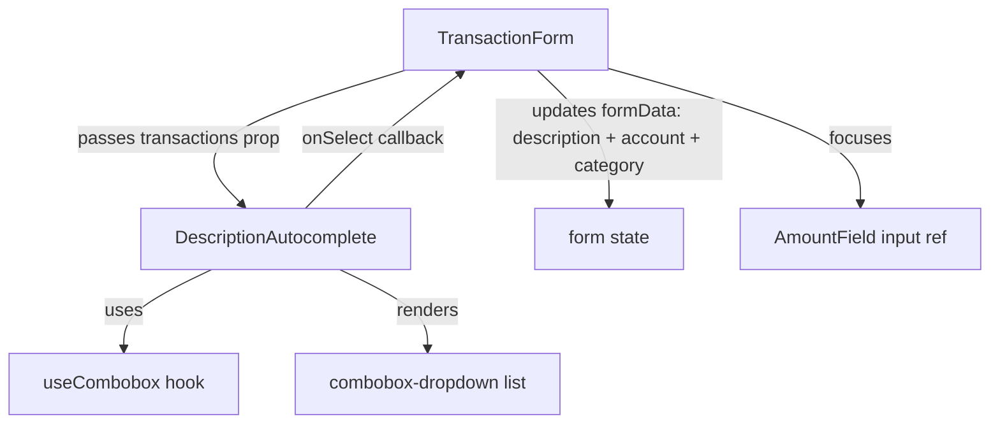
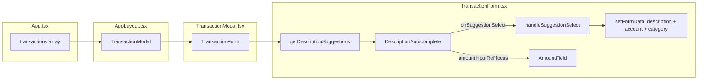

# Description Autocomplete — Implementation Plan

## 1. Overview

When the user types in the **Description** field of `TransactionForm`, a dropdown appears showing past transactions whose descriptions match the typed text (prefix/substring match). Selecting a suggestion fills the description, account, and category fields, then moves focus to the amount field.

No new backend endpoint is needed — suggestions are derived from the `transactions` array already loaded in the app.

---

## 2. Architecture Diagram



---

## 3. Data Model: `DescriptionSuggestion`

A new local type (defined inside the new component file, not exported to `types/index.ts` since it is UI-only):

```
interface DescriptionSuggestion {
  description: string;       // unique description text
  account: string;           // account name from the most-recent matching transaction
  category: string;          // category name (empty string for transfers)
  transactionType: TransactionType;  // "purchase" | "earning" | "transfer"
}
```

### Extraction logic

From the `transactions: Transaction[]` array passed to `TransactionForm`, build a deduplicated list of suggestions:

- Filter out transactions with no `description` (or empty string).
- Deduplicate by `description` (case-insensitive), keeping the **most-recent** occurrence (transactions are already reversed-chronological from `useTransactions`).
- For each unique description, capture `account` (or `from_account` for transfers), `category` (empty for transfers), and `type`.
- This logic lives in a pure utility function `getDescriptionSuggestions(transactions: Transaction[]): DescriptionSuggestion[]` added to [`frontend/src/utils/transactionUtils.ts`](frontend/src/utils/transactionUtils.ts).

### Filtering logic (inside the component)

When the user types, filter suggestions where `description.toLowerCase().includes(inputValue.toLowerCase())` — substring match, case-insensitive. Show at most **8** suggestions to keep the list manageable.

---

## 4. New Files

### 4.1 `frontend/src/components/form-fields/DescriptionAutocomplete.tsx`

This **replaces** `DescriptionField` in `TransactionForm`. It is a self-contained combobox for the description field.

**Props interface:**

```typescript
interface DescriptionAutocompleteProps {
  value: string;
  onChange: (value: string) => void;
  onSuggestionSelect: (suggestion: DescriptionSuggestion) => void;
  suggestions: DescriptionSuggestion[]; // pre-computed by parent
  disabled?: boolean;
  amountInputRef?: React.RefObject<HTMLInputElement | null>; // for focus-shift
}
```

**Key design decisions:**

- **Does NOT use `useCombobox`** for its internal state management. The reason: `useCombobox` is designed for _selection_ comboboxes (AccountSelect, CategorySelect) where the input value is always synced to a selected item's label. The description field is a _free-text_ field that also happens to offer suggestions — the user can type anything without selecting. Using `useCombobox` would force the input value to revert to the selected item's label on blur, which is wrong here.
- Instead, it manages its own minimal state: `isOpen: boolean`, `activeIndex: number`, using `useRef` for the container (click-outside detection) and the input.
- The `handleKeyDown` logic mirrors `AccountSelect`/`CategorySelect`: ArrowDown/Up navigate, Enter selects, Escape closes without reverting text, Tab closes.
- On **selection**: calls `onSuggestionSelect(suggestion)`, sets `isOpen(false)`, then calls `amountInputRef.current?.focus()`.
- The input `onChange` handler calls `props.onChange(e.target.value)` (keeps parent in sync) and opens the dropdown if there are matching suggestions.
- The dropdown only opens when `inputValue.length > 0` (unlike AccountSelect which opens on focus even when empty). This avoids showing all past descriptions on every focus.

**Rendered structure** (reuses `combobox.css` classes):

```
<div class="description-autocomplete" ref={containerRef}>
  <div class="form-group">
    <label>Description (optional)</label>
    <div class="description-autocomplete__input-wrapper">
      <input
        ref={inputRef}
        type="text"
        class="description-autocomplete__input"   ← plain input, NOT combobox-input-wrapper
        role="combobox"
        aria-expanded={isOpen}
        aria-autocomplete="list"
        aria-controls="description-autocomplete-listbox"
        ...
      />
    </div>
    {isOpen && filteredSuggestions.length > 0 && (
      <ul
        id="description-autocomplete-listbox"
        ref={listRef}
        class="combobox-dropdown"
        role="listbox"
      >
        {filteredSuggestions.map((s, idx) => (
          <li
            class="combobox-option [combobox-option--active]"
            role="option"
            onMouseDown={...}
            onMouseEnter={...}
          >
            <span class="combobox-option-label">{s.description}</span>
            <span class="combobox-option-meta">{s.account}</span>
          </li>
        ))}
      </ul>
    )}
  </div>
</div>
```

**Note on styling:** The input itself uses the existing `.form-group input` styles from `TransactionForm.css` (not the combobox wrapper styles), so it looks identical to the current description field. Only the dropdown reuses `.combobox-dropdown`, `.combobox-option`, `.combobox-option--active`, `.combobox-option-label`, `.combobox-option-meta` from `combobox.css`. The container needs `position: relative` so the absolute-positioned dropdown aligns correctly.

### 4.2 No new CSS file needed

All dropdown styles come from the already-imported [`frontend/src/styles/combobox.css`](frontend/src/styles/combobox.css). The only new CSS rule needed is `position: relative` on the `.description-autocomplete` wrapper — this can be added as a small block in a new file `frontend/src/components/form-fields/DescriptionAutocomplete.css` (imported by the component) to keep concerns separated:

```css
/* DescriptionAutocomplete.css */
.description-autocomplete {
  position: relative;
}
```

---

## 5. Changes to Existing Files

### 5.1 [`frontend/src/utils/transactionUtils.ts`](frontend/src/utils/transactionUtils.ts)

Add the pure utility function `getDescriptionSuggestions`:

```typescript
export interface DescriptionSuggestion {
  description: string;
  account: string;
  category: string;
  transactionType: TransactionType;
}

export function getDescriptionSuggestions(
  transactions: Transaction[],
): DescriptionSuggestion[] {
  const seen = new Map<string, DescriptionSuggestion>();
  for (const tx of transactions) {
    if (!tx.description?.trim()) continue;
    const key = tx.description.trim().toLowerCase();
    if (seen.has(key)) continue; // keep first (most-recent, since array is reversed)
    const account = tx.type === "transfer" ? tx.from_account : tx.account;
    const category = tx.type === "transfer" ? "" : (tx.category ?? "");
    seen.set(key, {
      description: tx.description.trim(),
      account,
      category,
      transactionType: tx.type,
    });
  }
  return Array.from(seen.values());
}
```

**Why here:** This is a pure data-transformation function with no UI concerns, consistent with the other utilities in this file. Exporting `DescriptionSuggestion` from here (rather than `types/index.ts`) keeps it co-located with the function that produces it, and avoids polluting the global types file with a UI-specific shape.

### 5.2 [`frontend/src/components/TransactionForm.tsx`](frontend/src/components/TransactionForm.tsx)

**Changes:**

1. **Add `transactions` prop** to `TransactionFormProps`:

   ```typescript
   transactions: Transaction[];
   ```

2. **Import** `DescriptionAutocomplete` and `getDescriptionSuggestions`, and `useRef` for the amount field ref.

3. **Compute suggestions** inside the component body (memoized with `useMemo`):

   ```typescript
   const descriptionSuggestions = useMemo(
     () => getDescriptionSuggestions(transactions),
     [transactions],
   );
   ```

4. **Create `amountInputRef`** (`useRef<HTMLInputElement | null>(null)`) and pass it to `AmountField` (see §5.3).

5. **Replace `<DescriptionField>`** with `<DescriptionAutocomplete>`:

   ```tsx
   <DescriptionAutocomplete
     value={formData.description || ""}
     onChange={(description) => setFormData({ ...formData, description })}
     onSuggestionSelect={handleSuggestionSelect}
     suggestions={descriptionSuggestions}
     disabled={loading}
     amountInputRef={amountInputRef}
   />
   ```

6. **Add `handleSuggestionSelect`** callback:

   ```typescript
   const handleSuggestionSelect = useCallback(
     (suggestion: DescriptionSuggestion) => {
       if (formData.type === "transfer") {
         // For transfers, only fill description (no account/category to fill)
         setFormData((prev) => ({
           ...prev,
           description: suggestion.description,
         }));
       } else {
         setFormData((prev) => ({
           ...prev,
           description: suggestion.description,
           account: suggestion.account || prev.account,
           category: suggestion.category || prev.category,
         }));
       }
       // Focus shift happens inside DescriptionAutocomplete after onSuggestionSelect
     },
     [formData.type],
   );
   ```

   **Note on type mismatch:** The suggestion's `transactionType` may differ from the current form type (e.g., user is adding a "purchase" but the suggestion came from an "earning"). The handler should still fill `account` and `category` from the suggestion — the user can correct them. Only for `transfer` type do we skip account/category since the form shape is different.

### 5.3 [`frontend/src/components/form-fields/AmountField.tsx`](frontend/src/components/form-fields/AmountField.tsx)

Add an optional `inputRef` prop so `TransactionForm` can pass a ref to the amount input for programmatic focus:

```typescript
interface AmountFieldProps {
  value: string;
  onChange: (value: string) => void;
  disabled?: boolean;
  inputRef?: React.RefObject<HTMLInputElement | null>;
}
```

Wire it: `<input ref={inputRef} ...>`.

### 5.4 [`frontend/src/components/TransactionModal.tsx`](frontend/src/components/TransactionModal.tsx)

Add `transactions` prop and pass it through to `TransactionForm`:

```typescript
interface TransactionModalProps {
  // ... existing props
  transactions: Transaction[];
}
// ...
<TransactionForm
  transactions={transactions}
  accounts={accounts}
  // ...
/>
```

### 5.5 [`frontend/src/components/layout/AppLayout.tsx`](frontend/src/components/layout/AppLayout.tsx)

Add `transactions: Transaction[]` to `AppLayoutProps` and pass it to `<TransactionModal>`:

```tsx
<TransactionModal
  transactions={transactions}
  // ... existing props
/>
```

### 5.6 [`frontend/src/App.tsx`](frontend/src/App.tsx)

Pass `transactions` to `<AppLayout>`:

```tsx
<AppLayout
  transactions={transactions}
  // ... existing props
/>
```

---

## 6. Data Flow Diagram



---

## 7. Keyboard Navigation Specification

| Key                     | Behavior                                                                     |
| ----------------------- | ---------------------------------------------------------------------------- |
| Any character typed     | Opens dropdown if matching suggestions exist                                 |
| `ArrowDown`             | Moves active index down; wraps to first if at end                            |
| `ArrowUp`               | Moves active index up; wraps to last if at start                             |
| `Enter`                 | Selects active suggestion; if none active, does nothing (allows form submit) |
| `Escape`                | Closes dropdown; does NOT clear typed text                                   |
| `Tab`                   | Closes dropdown; moves focus to next field naturally                         |
| Mouse hover             | Sets active index                                                            |
| Mouse click (mousedown) | Selects suggestion; prevents blur race condition                             |

**Important:** `Enter` with no active suggestion must NOT call `e.preventDefault()`, so the form's `onSubmit` fires normally.

---

## 8. Accessibility

- Input has `role="combobox"`, `aria-expanded`, `aria-autocomplete="list"`, `aria-controls="description-autocomplete-listbox"`, `aria-activedescendant`.
- List has `role="listbox"`, `aria-label="Description suggestions"`.
- Each option has `role="option"`, `aria-selected` (always `false` since description is free-text, not a selection).
- `autoComplete="off"` on the input to suppress browser autocomplete.

---

## 9. Edge Cases

| Scenario                                                      | Handling                                                                   |
| ------------------------------------------------------------- | -------------------------------------------------------------------------- |
| No past transactions with descriptions                        | Dropdown never opens; component behaves as plain text input                |
| User types but no suggestions match                           | Dropdown stays closed (or closes if it was open)                           |
| Suggestion's `transactionType` differs from current form type | Fill description, account, category anyway; user can correct               |
| Form is in `transfer` mode                                    | Only description is filled; account/category fields are skipped            |
| Form is in `edit` mode                                        | Feature works identically; suggestions still shown                         |
| `description` is `undefined` or empty string                  | Filtered out of suggestions                                                |
| Duplicate descriptions (case-insensitive)                     | Only the most-recent transaction's account/category is used                |
| User clears the input after selecting                         | Dropdown reopens if they type again; no auto-revert (unlike AccountSelect) |

---

## 10. Complete File Change List

| File                                                              | Change Type   | Summary                                                                                                                  |
| ----------------------------------------------------------------- | ------------- | ------------------------------------------------------------------------------------------------------------------------ |
| `frontend/src/components/form-fields/DescriptionAutocomplete.tsx` | **NEW**       | New autocomplete component replacing DescriptionField in TransactionForm                                                 |
| `frontend/src/components/form-fields/DescriptionAutocomplete.css` | **NEW**       | Single rule: `position: relative` on wrapper                                                                             |
| `frontend/src/utils/transactionUtils.ts`                          | **MODIFY**    | Add `DescriptionSuggestion` interface + `getDescriptionSuggestions()` function                                           |
| `frontend/src/components/TransactionForm.tsx`                     | **MODIFY**    | Add `transactions` prop, `amountInputRef`, `handleSuggestionSelect`, swap `DescriptionField` → `DescriptionAutocomplete` |
| `frontend/src/components/form-fields/AmountField.tsx`             | **MODIFY**    | Add optional `inputRef` prop wired to the `<input>` element                                                              |
| `frontend/src/components/TransactionModal.tsx`                    | **MODIFY**    | Add `transactions` prop, pass to `TransactionForm`                                                                       |
| `frontend/src/components/layout/AppLayout.tsx`                    | **MODIFY**    | Add `transactions` prop, pass to `TransactionModal`                                                                      |
| `frontend/src/App.tsx`                                            | **MODIFY**    | Pass `transactions` to `AppLayout`                                                                                       |
| `frontend/src/components/form-fields/DescriptionField.tsx`        | **NO CHANGE** | Kept as-is (still used elsewhere if needed; TransactionForm stops importing it)                                          |

---

## 11. Why NOT Reuse `useCombobox` Directly

`useCombobox` is designed for **selection** comboboxes:

- It syncs `inputValue` to the selected item's label on select.
- It reverts `inputValue` to the last selected value on blur/Escape.
- It opens on focus even with empty input.

The description field is a **free-text field with suggestions**:

- The user can type anything — the input value is the actual form value, not a display label for a selected item.
- Escape should close the dropdown but keep whatever the user typed.
- The dropdown should only open when the user has typed something.
- On selection, focus should move to the amount field (not stay on the description input).

These behavioral differences make direct reuse of `useCombobox` a poor fit. The new component manages its own minimal state (`isOpen`, `activeIndex`) with `useState`, and uses `useRef` for click-outside detection — the same pattern `AccountSelect` uses but without the selection-revert semantics.

---

## 12. Implementation Order (for Code mode)

1. Add `getDescriptionSuggestions` + `DescriptionSuggestion` to `transactionUtils.ts`
2. Add `inputRef` prop to `AmountField.tsx`
3. Create `DescriptionAutocomplete.css`
4. Create `DescriptionAutocomplete.tsx`
5. Modify `TransactionForm.tsx` (add prop, swap component, add handler, add ref)
6. Modify `TransactionModal.tsx` (add prop, pass through)
7. Modify `AppLayout.tsx` (add prop, pass through)
8. Modify `App.tsx` (pass `transactions` to `AppLayout`)
