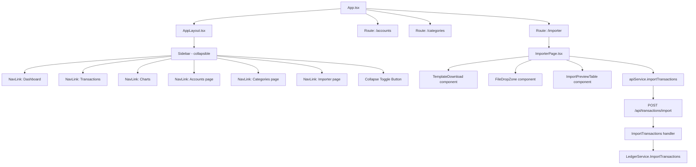

# Importer & Nav Restructuring — Technical Plan

> **Scope:** Collapsible sidebar, nav restructuring (Accounts/Categories/Importer as nav links), CSV Importer page, and backend import endpoint.
> **Stack:** React + TypeScript (Vite) frontend · Go backend (stdlib `net/http`, JSON file storage)

---

## Table of Contents

1. [Current State Summary](#1-current-state-summary)
2. [Feature Overview & Architecture](#2-feature-overview--architecture)
3. [Component Structure & File Locations](#3-component-structure--file-locations)
4. [Feature 1 — Collapsible Navigation](#4-feature-1--collapsible-navigation)
5. [Feature 2 — Nav Restructuring](#5-feature-2--nav-restructuring)
6. [Feature 3 — CSV Importer Page](#6-feature-3--csv-importer-page)
7. [Feature 4 — Backend CSV Import Endpoint](#7-feature-4--backend-csv-import-endpoint)
8. [State Management Approach](#8-state-management-approach)
9. [CSV Format Specification](#9-csv-format-specification)
10. [Step-by-Step Implementation Order](#10-step-by-step-implementation-order)

---

## 1. Current State Summary

### Frontend Layout

- [`AppLayout.tsx`](../frontend/src/components/layout/AppLayout.tsx) renders a fixed 220px sidebar (`app-sidebar`) with:
  - Brand block (icon + name + tagline)
  - `<nav>` with three `<NavLink>` items: Dashboard, Transactions, Charts
  - `sidebar-actions` section with two `<button>` elements that open **modals** for Accounts and Categories
- The sidebar has no collapse mechanism; width is hardcoded to `220px` in [`AppLayout.css`](../frontend/src/components/layout/AppLayout.css:9)
- [`App.tsx`](../frontend/src/App.tsx) owns all modal state and passes it down as props to `AppLayout`

### Backend Routes (relevant)

| Method | Path                | Handler              |
| ------ | ------------------- | -------------------- |
| `GET`  | `/api/transactions` | `GetAllTransactions` |
| `POST` | `/api/transactions` | `CreateTransaction`  |
| `GET`  | `/api/accounts`     | `GetAllAccounts`     |
| `GET`  | `/api/categories`   | `GetAllCategories`   |

The router in [`main.go`](../backend/main.go:101) uses Go's stdlib `http.ServeMux` with manual prefix matching. New routes must be registered **before** their prefix siblings to avoid shadowing.

### Transaction Model

[`models/transaction.go`](../backend/models/transaction.go:58) — key fields for CSV import:

| Field          | Type                | Notes                                       |
| -------------- | ------------------- | ------------------------------------------- |
| `type`         | `TransactionType`   | `"purchase"` \| `"earning"` \| `"transfer"` |
| `date`         | `Date` (YYYY-MM-DD) | Custom JSON marshaler                       |
| `amount`       | `float64`           | Must be > 0                                 |
| `description`  | `string`            | Optional                                    |
| `account`      | `*string`           | Required for purchase/earning               |
| `category`     | `*string`           | Required for purchase/earning               |
| `from_account` | `*string`           | Required for transfer                       |
| `to_account`   | `*string`           | Required for transfer                       |

---

## 2. Feature Overview & Architecture



---

## 3. Component Structure & File Locations

### New & Modified Files

```
frontend/src/
├── components/
│   └── layout/
│       ├── AppLayout.tsx          ← MODIFY: collapse state, new nav links
│       └── AppLayout.css          ← MODIFY: collapse CSS + transitions
├── pages/
│   ├── AccountsPage.tsx           ← NEW: dedicated accounts management page
│   ├── AccountsPage.css           ← NEW
│   ├── CategoriesPage.tsx         ← NEW: dedicated categories management page
│   ├── CategoriesPage.css         ← NEW
│   ├── ImporterPage.tsx           ← NEW: CSV importer page
│   └── ImporterPage.css           ← NEW
├── components/
│   └── importer/
│       ├── FileDropZone.tsx       ← NEW: drag-and-drop upload area
│       ├── FileDropZone.css       ← NEW
│       ├── ImportPreviewTable.tsx ← NEW: parsed CSV preview + validation
│       └── ImportPreviewTable.css ← NEW
├── services/
│   └── api.ts                     ← MODIFY: add importTransactions()
└── types/
    └── index.ts                   ← MODIFY: add ImportResult, CsvRow types

backend/
├── handlers/
│   └── transactions.go            ← MODIFY: add ImportTransactions handler
├── models/
│   └── import_request.go          ← NEW: CsvRow, ImportResult models
└── main.go                        ← MODIFY: register /api/transactions/import route
```

---

## 4. Feature 1 — Collapsible Navigation

### State

- A single boolean `isCollapsed` lives in [`AppLayout.tsx`](../frontend/src/components/layout/AppLayout.tsx) as local `useState`
- On mount, read from `localStorage.getItem('sidebar-collapsed')` to restore persisted state
- On toggle, write back to `localStorage.setItem('sidebar-collapsed', ...)`

```tsx
// Inside AppLayout component
const [isCollapsed, setIsCollapsed] = useState<boolean>(() => {
  return localStorage.getItem("sidebar-collapsed") === "true";
});

const toggleCollapse = () => {
  setIsCollapsed((prev) => {
    const next = !prev;
    localStorage.setItem("sidebar-collapsed", String(next));
    return next;
  });
};
```

### CSS Approach

The sidebar width transitions between `220px` (expanded) and `64px` (collapsed, icon-only). All text labels use `opacity` + `width` transitions so they fade out smoothly without layout jumps.

**Key CSS additions to [`AppLayout.css`](../frontend/src/components/layout/AppLayout.css):**

```css
/* Transition on the sidebar itself */
.app-sidebar {
  width: 220px;
  transition: width 0.25s ease;
  overflow: hidden; /* clip text during transition */
}

/* Collapsed state — applied via data attribute or class */
.app-sidebar--collapsed {
  width: 64px;
}

/* Brand text fades out */
.app-sidebar--collapsed .sidebar-brand-text {
  opacity: 0;
  width: 0;
  overflow: hidden;
  transition:
    opacity 0.2s ease,
    width 0.2s ease;
}

/* Nav labels fade out */
.app-sidebar--collapsed .sidebar-nav-label,
.app-sidebar--collapsed .sidebar-action-label {
  opacity: 0;
  width: 0;
  overflow: hidden;
  white-space: nowrap;
  transition:
    opacity 0.15s ease,
    width 0.15s ease;
}

/* Collapsed nav links center their icon */
.app-sidebar--collapsed .sidebar-nav-link {
  justify-content: center;
  padding: 10px;
}

/* Collapse toggle button */
.sidebar-collapse-btn {
  display: flex;
  align-items: center;
  justify-content: center;
  width: 28px;
  height: 28px;
  border-radius: 6px;
  border: 1px solid var(--border-color);
  background: var(--bg-tertiary);
  color: var(--text-secondary);
  cursor: pointer;
  transition:
    background 0.15s,
    color 0.15s;
  flex-shrink: 0;
}

.sidebar-collapse-btn:hover {
  background: var(--bg-tertiary);
  color: var(--text-primary);
}
```

**Implementation approach:**

- Add `data-collapsed={isCollapsed}` attribute to `<aside>` OR toggle a CSS class `app-sidebar--collapsed`
- The class approach is cleaner and avoids attribute selectors
- All label `<span>` elements already have `sidebar-nav-label` / `sidebar-action-label` classes — just add the opacity/width rules

**Collapse toggle button placement:**

- Positioned at the bottom of the brand section (top-right corner of the brand block)
- Uses a `‹` / `›` chevron icon (or `←` / `→`) that rotates 180° when collapsed
- The button itself stays visible in both states (icon only, no label)

**Tooltip support (collapsed state):**

- Add `title` attribute to each `<NavLink>` and action button so the browser shows a native tooltip on hover when labels are hidden
- Example: `<NavLink title="Dashboard" ...>`

**Responsive behavior:**

- On mobile (`max-width: 768px`), the sidebar is already horizontal — collapse toggle is hidden on mobile (the sidebar auto-adapts to a top bar)

---

## 5. Feature 2 — Nav Restructuring

### Current vs. New Structure

**Current:**

- Nav links: Dashboard, Transactions, Charts
- Sidebar actions (buttons opening modals): Accounts, Categories

**New:**

- Nav links: Dashboard, Transactions, Charts, **Accounts**, **Categories**, **Importer**
- Sidebar actions section: **removed** (Accounts and Categories become full pages)

### Decision: Pages vs. Modals

The Accounts and Categories management currently lives in modals (`AccountManagementModal`, `CategoryManagementModal`) opened from `App.tsx`. The plan is to:

1. Create dedicated `/accounts` and `/categories` pages that **embed** the existing modal content as inline page content (not modals)
2. Keep the existing modals intact for backward compatibility (they may still be used from other contexts)
3. The new pages reuse the existing sub-components from `frontend/src/components/accounts/` and `frontend/src/components/categories/`

This avoids a large refactor of the modal internals while giving users a proper routed page experience.

### Nav Link Changes in `AppLayout.tsx`

Remove the `sidebar-actions` div entirely. Add three new `<NavLink>` entries to the `<nav>`:

```tsx
<NavLink to="/accounts" className={...}>
  <span className="sidebar-nav-icon" aria-hidden="true">🏦</span>
  <span className="sidebar-nav-label">Accounts</span>
</NavLink>

<NavLink to="/categories" className={...}>
  <span className="sidebar-nav-icon" aria-hidden="true">🏷️</span>
  <span className="sidebar-nav-label">Categories</span>
</NavLink>

<NavLink to="/importer" className={...}>
  <span className="sidebar-nav-icon" aria-hidden="true">📥</span>
  <span className="sidebar-nav-label">Importer</span>
</NavLink>
```

### Props Cleanup in `AppLayout`

Since Accounts and Categories are now pages (not modals launched from the sidebar), the following props can be **removed** from `AppLayoutProps`:

- `isAccountModalOpen`, `onOpenAccountModal`, `onCloseAccountModal`
- `isCategoryModalOpen`, `onOpenCategoryModal`, `onCloseCategoryModal`
- `onCreateAccount`, `onUpdateAccount`, `onDeleteAccount`, `onSetMainAccount`
- `onCreateCategory`, `onUpdateCategory`, `onDeleteCategory`
- `onViewBills`

These callbacks move to the respective page components (`AccountsPage`, `CategoriesPage`) which call hooks directly.

**Note:** `App.tsx` will need corresponding cleanup of the props passed to `<AppLayout>`.

### New Routes in `App.tsx`

```tsx
<Route path="/accounts" element={<AccountsPage />} />
<Route path="/categories" element={<CategoriesPage />} />
<Route path="/importer" element={<ImporterPage />} />
```

---

## 6. Feature 3 — CSV Importer Page

### Page: `ImporterPage.tsx`

**Route:** `/importer`

**Layout:**

```
┌─────────────────────────────────────────────────────┐
│  📥 Import Transactions                              │
│  Import transactions from a CSV file.               │
│  [Download Template ↓]                              │
├─────────────────────────────────────────────────────┤
│  ┌─────────────────────────────────────────────┐   │
│  │  Drag & drop your CSV file here             │   │
│  │  or click to browse                         │   │
│  │                                             │   │
│  │  [📄 icon]                                  │   │
│  └─────────────────────────────────────────────┘   │
├─────────────────────────────────────────────────────┤
│  Preview (N rows)          [Clear] [Import N rows]  │
│  ┌──────┬─────────────┬────────┬──────┬──────────┐ │
│  │ date │ description │ amount │ type │ category │ │
│  ├──────┼─────────────┼────────┼──────┼──────────┤ │
│  │ ✅   │ Groceries   │ 50.00  │ ...  │ ...      │ │
│  │ ❌   │ (error msg) │ -      │ ...  │ ...      │ │
│  └──────┴─────────────┴────────┴──────┴──────────┘ │
│  Import result: 8 imported, 2 failed               │
└─────────────────────────────────────────────────────┘
```

### Sub-component: `FileDropZone.tsx`

**Props:**

```tsx
interface FileDropZoneProps {
  onFileSelected: (file: File) => void;
  isLoading: boolean;
  accept?: string; // default ".csv"
}
```

**Behavior:**

- `dragover` / `dragleave` / `drop` event handlers on the drop zone div
- `<input type="file" accept=".csv" hidden>` triggered on click
- Visual feedback: border color changes on drag-over (`--accent-blue` border)
- Shows selected filename once a file is chosen
- Validates file extension client-side before calling `onFileSelected`

### Sub-component: `ImportPreviewTable.tsx`

**Props:**

```tsx
interface ParsedRow {
  rowNumber: number;
  raw: Record<string, string>; // raw CSV values
  parsed: CsvTransactionRow | null; // null if parse failed
  errors: string[]; // validation error messages
  isValid: boolean;
}

interface ImportPreviewTableProps {
  rows: ParsedRow[];
  isLoading: boolean;
}
```

**Behavior:**

- Renders a scrollable table with columns: `#`, `Status`, `date`, `description`, `amount`, `type`, `account/from_account`, `category/to_account`, `notes`
- Status column: ✅ green check for valid rows, ❌ red X for invalid rows
- Invalid rows show error message in a tooltip or inline below the row
- Valid row count shown in header: "12 valid, 2 invalid"

### Download Template Button

Generates and downloads a CSV file **client-side** using a `Blob`:

```tsx
function downloadTemplate() {
  const headers =
    "date,description,amount,type,account,category,from_account,to_account,notes";
  const examples = [
    "2024-01-15,Grocery shopping,85.50,purchase,Checking,Food & Dining,,,Weekly groceries",
    "2024-01-16,Monthly salary,5000.00,earning,Checking,Salary,,,January salary",
    "2024-01-17,Savings transfer,500.00,transfer,,,Checking,Savings,Monthly savings",
  ].join("\n");
  const csv = `${headers}\n${examples}`;
  const blob = new Blob([csv], { type: "text/csv" });
  const url = URL.createObjectURL(blob);
  const a = document.createElement("a");
  a.href = url;
  a.download = "geode-import-template.csv";
  a.click();
  URL.revokeObjectURL(url);
}
```

### Client-Side CSV Parsing

Use the browser's built-in string splitting (no external library needed for simple CSVs). Parse logic:

1. Split by newlines, skip empty lines
2. First line = headers (normalize to lowercase, trim whitespace)
3. For each subsequent line: split by comma (handle quoted fields with a simple state machine)
4. Map to `ParsedRow` objects, running validation per row

**Validation rules (client-side, mirrors backend):**

- `date`: must match `YYYY-MM-DD` regex
- `amount`: must be a positive number
- `type`: must be `purchase`, `earning`, or `transfer`
- For `purchase`/`earning`: `account` and `category` must be non-empty
- For `transfer`: `from_account` and `to_account` must be non-empty and different
- `notes` is always optional

### Page State Machine

```
idle → file-selected → parsing → previewing → importing → done
                                     ↑                      ↓
                                  (re-upload)            (clear)
```

State shape:

```tsx
type ImporterState =
  | { phase: "idle" }
  | { phase: "parsing" }
  | {
      phase: "previewing";
      rows: ParsedRow[];
      validCount: number;
      invalidCount: number;
    }
  | { phase: "importing" }
  | { phase: "done"; result: ImportResult };
```

### Data Flow

```
User drops file
  → FileDropZone.onFileSelected(file)
    → ImporterPage reads file as text (FileReader API)
      → parseCsv(text) → ParsedRow[]
        → setState({ phase: 'previewing', rows })
          → ImportPreviewTable renders rows
            → User clicks "Import N rows"
              → apiService.importTransactions(validRows)
                → POST /api/transactions/import
                  → setState({ phase: 'done', result })
```

---

## 7. Feature 4 — Backend CSV Import Endpoint

### New Route

```
POST /api/transactions/import
Content-Type: multipart/form-data
Body: file field named "file" (CSV)
```

**Registration in [`main.go`](../backend/main.go:106):**

This route must be registered **before** `/api/transactions/` to avoid the trailing-slash handler catching it:

```go
mux.HandleFunc("/api/transactions/import", middleware.Chain(
    func(w http.ResponseWriter, r *http.Request) {
        if r.Method == http.MethodPost {
            h.transactions.ImportTransactions(w, r)
        } else {
            handlers.WriteError(w, http.StatusMethodNotAllowed, "Method not allowed")
        }
    },
    mw...,
))
```

### New Model: `backend/models/import_request.go`

```go
package models

// CsvTransactionRow represents a single parsed row from an import CSV
type CsvTransactionRow struct {
    Date        string  `json:"date"`
    Description string  `json:"description"`
    Amount      float64 `json:"amount"`
    Type        string  `json:"type"`
    Account     string  `json:"account"`
    Category    string  `json:"category"`
    FromAccount string  `json:"from_account"`
    ToAccount   string  `json:"to_account"`
    Notes       string  `json:"notes"`
}

// ImportRowResult reports the outcome of importing a single CSV row
type ImportRowResult struct {
    Row     int    `json:"row"`
    Success bool   `json:"success"`
    Error   string `json:"error,omitempty"`
    ID      string `json:"id,omitempty"` // transaction ID if created
}

// ImportResult is the response body for POST /api/transactions/import
type ImportResult struct {
    Total    int               `json:"total"`
    Imported int               `json:"imported"`
    Failed   int               `json:"failed"`
    Rows     []ImportRowResult `json:"rows"`
}
```

### Handler: `ImportTransactions` in `transactions.go`

```go
func (h *TransactionHandler) ImportTransactions(w http.ResponseWriter, r *http.Request) {
    // 1. Parse multipart form (max 10MB)
    if err := r.ParseMultipartForm(10 << 20); err != nil {
        WriteError(w, http.StatusBadRequest, "Failed to parse form")
        return
    }

    // 2. Get file from form
    file, _, err := r.FormFile("file")
    if err != nil {
        WriteError(w, http.StatusBadRequest, "No file provided (field: 'file')")
        return
    }
    defer file.Close()

    // 3. Parse CSV
    rows, parseErr := parseImportCSV(file)
    if parseErr != nil {
        WriteError(w, http.StatusBadRequest, parseErr.Error())
        return
    }

    // 4. Import each row via ledger service
    result := h.ledger.ImportTransactions(rows)

    // 5. Return 200 with summary (even if some rows failed)
    WriteJSON(w, http.StatusOK, result)
}
```

### CSV Parsing (backend)

Use Go's standard `encoding/csv` package:

```go
func parseImportCSV(r io.Reader) ([]models.CsvTransactionRow, error) {
    reader := csv.NewReader(r)
    reader.TrimLeadingSpace = true

    headers, err := reader.Read() // first row = headers
    if err != nil {
        return nil, fmt.Errorf("failed to read CSV headers: %w", err)
    }

    // Normalize headers to lowercase
    colIndex := map[string]int{}
    for i, h := range headers {
        colIndex[strings.ToLower(strings.TrimSpace(h))] = i
    }

    // Validate required columns exist
    required := []string{"date", "amount", "type"}
    for _, col := range required {
        if _, ok := colIndex[col]; !ok {
            return nil, fmt.Errorf("missing required column: %s", col)
        }
    }

    var rows []models.CsvTransactionRow
    for {
        record, err := reader.Read()
        if err == io.EOF { break }
        if err != nil { return nil, err }

        row := models.CsvTransactionRow{
            Date:        getCol(record, colIndex, "date"),
            Description: getCol(record, colIndex, "description"),
            Amount:      parseAmount(getCol(record, colIndex, "amount")),
            Type:        getCol(record, colIndex, "type"),
            Account:     getCol(record, colIndex, "account"),
            Category:    getCol(record, colIndex, "category"),
            FromAccount: getCol(record, colIndex, "from_account"),
            ToAccount:   getCol(record, colIndex, "to_account"),
            Notes:       getCol(record, colIndex, "notes"),
        }
        rows = append(rows, row)
    }
    return rows, nil
}
```

### Service Method: `LedgerService.ImportTransactions`

Added to [`services/ledger.go`](../backend/services/ledger.go):

```go
func (s *LedgerService) ImportTransactions(rows []models.CsvTransactionRow) *models.ImportResult {
    result := &models.ImportResult{Total: len(rows)}

    // Pre-load accounts and categories for name matching
    accounts, _ := s.storage.GetAccounts()
    categories, _ := s.storage.GetCategories()

    accountMap := buildAccountMap(accounts)   // lowercase name → Account
    categoryMap := buildCategoryMap(categories) // lowercase name → Category

    for i, row := range rows {
        rowNum := i + 2 // 1-based, +1 for header row

        tx, err := rowToTransaction(row, accountMap, categoryMap)
        if err != nil {
            result.Failed++
            result.Rows = append(result.Rows, models.ImportRowResult{
                Row: rowNum, Success: false, Error: err.Error(),
            })
            continue
        }

        created, err := s.CreateTransaction(tx)
        if err != nil {
            result.Failed++
            result.Rows = append(result.Rows, models.ImportRowResult{
                Row: rowNum, Success: false, Error: err.Error(),
            })
            continue
        }

        result.Imported++
        result.Rows = append(result.Rows, models.ImportRowResult{
            Row: rowNum, Success: true, ID: created[0].ID,
        })
    }

    return result
}
```

**Account/Category matching:**

- Case-insensitive: `strings.ToLower(name)` lookup in pre-built maps
- If account/category name not found → row fails with descriptive error: `"account 'Savings' not found"`
- The `notes` field maps to `Description` if `description` column is empty, otherwise appended: `"description (notes)"`

### Response Example

```json
{
  "total": 10,
  "imported": 8,
  "failed": 2,
  "rows": [
    { "row": 2, "success": true, "id": "uuid-1" },
    { "row": 3, "success": true, "id": "uuid-2" },
    { "row": 5, "success": false, "error": "account 'OldBank' not found" },
    { "row": 9, "success": false, "error": "amount must be greater than 0" }
  ]
}
```

### Frontend API Method

Added to [`api.ts`](../frontend/src/services/api.ts):

```ts
async importTransactions(file: File): Promise<ImportResult> {
  const formData = new FormData();
  formData.append('file', file);
  const response = await fetch(`${API_BASE_URL}/transactions/import`, {
    method: 'POST',
    body: formData,
    // Do NOT set Content-Type — browser sets it with boundary automatically
  });
  return this.handleResponse<ImportResult>(response);
}
```

### New Frontend Types

Added to [`types/index.ts`](../frontend/src/types/index.ts):

```ts
export interface CsvTransactionRow {
  date: string;
  description: string;
  amount: string; // string for form handling; parsed to number before send
  type: "purchase" | "earning" | "transfer";
  account: string;
  category: string;
  from_account: string;
  to_account: string;
  notes: string;
}

export interface ImportRowResult {
  row: number;
  success: boolean;
  error?: string;
  id?: string;
}

export interface ImportResult {
  total: number;
  imported: number;
  failed: number;
  rows: ImportRowResult[];
}
```

---

## 8. State Management Approach

### Collapsible Nav State

- **Location:** Local `useState` inside `AppLayout`
- **Persistence:** `localStorage` key `'sidebar-collapsed'`
- **No prop drilling needed** — the collapse state only affects the sidebar's own rendering

### Importer Page State

- **Location:** Local `useState` inside `ImporterPage` — no global state needed
- The importer is a self-contained workflow; data does not need to be shared with other pages
- After a successful import, call `refetchTransactions()` — but since `ImporterPage` is a standalone route, it should call `apiService.getTransactions()` directly or accept an `onImportSuccess` callback prop from `App.tsx` that triggers a global refetch

**Recommended approach:** Pass `onImportSuccess: () => void` as a prop from `App.tsx` to `ImporterPage`, which calls `refetchData()`. This keeps the data-fetching pattern consistent with other pages.

### Accounts & Categories Pages

- Each page uses the existing hooks directly:
  - `AccountsPage` calls `useAccounts()` internally
  - `CategoriesPage` calls `useCategories()` internally
- This removes the need to pass account/category CRUD callbacks through `AppLayout`
- The `CreditCardBillModal` currently opened from `AccountManagementModal` can be managed locally within `AccountsPage`

---

## 9. CSV Format Specification

### Column Definitions

| Column         | Required                | Format                                | Notes                             |
| -------------- | ----------------------- | ------------------------------------- | --------------------------------- |
| `date`         | ✅                      | `YYYY-MM-DD`                          | e.g. `2024-01-15`                 |
| `description`  | ❌                      | free text                             | Transaction label                 |
| `amount`       | ✅                      | positive decimal                      | e.g. `85.50` — no currency symbol |
| `type`         | ✅                      | `purchase` \| `earning` \| `transfer` | Case-insensitive                  |
| `account`      | ✅ for purchase/earning | exact account name                    | Case-insensitive match            |
| `category`     | ✅ for purchase/earning | exact category name                   | Case-insensitive match            |
| `from_account` | ✅ for transfer         | exact account name                    | Case-insensitive match            |
| `to_account`   | ✅ for transfer         | exact account name                    | Case-insensitive match            |
| `notes`        | ❌                      | free text                             | Appended to description           |

### Template File Content

```csv
date,description,amount,type,account,category,from_account,to_account,notes
2024-01-15,Grocery shopping,85.50,purchase,Checking,Food & Dining,,,Weekly groceries
2024-01-16,Monthly salary,5000.00,earning,Checking,Salary,,,January salary
2024-01-17,Savings transfer,500.00,transfer,,,Checking,Savings,Monthly savings
2024-01-18,Netflix subscription,15.99,purchase,Checking,Entertainment,,,
2024-01-19,Freelance payment,1200.00,earning,Checking,Freelance,,,Project X
```

### Validation Rules

**Row-level (applied to each row independently):**

1. `date` must match regex `/^\d{4}-\d{2}-\d{2}$/` and be a valid calendar date
2. `amount` must parse to a float > 0
3. `type` must be one of `purchase`, `earning`, `transfer` (case-insensitive, normalized before processing)
4. If `type` is `purchase` or `earning`:
   - `account` must be non-empty
   - `category` must be non-empty
   - `from_account` and `to_account` must be empty
5. If `type` is `transfer`:
   - `from_account` must be non-empty
   - `to_account` must be non-empty
   - `from_account` ≠ `to_account`
   - `account` and `category` must be empty
6. Account names must match an existing account (case-insensitive)
7. Category names must match an existing category (case-insensitive) — only for purchase/earning

**File-level:**

- File must be valid UTF-8 text
- First row must contain at minimum the columns: `date`, `amount`, `type`
- Maximum file size: 10 MB (enforced by backend `ParseMultipartForm`)
- Empty rows are silently skipped

---

## 10. Step-by-Step Implementation Order

The implementation is ordered to minimize merge conflicts and allow incremental testing at each step.

### Phase 1 — Collapsible Nav (self-contained, no new routes)

**Step 1.1 — Add collapse state to `AppLayout`**

- File: [`frontend/src/components/layout/AppLayout.tsx`](../frontend/src/components/layout/AppLayout.tsx)
- Add `useState<boolean>` initialized from `localStorage.getItem('sidebar-collapsed')`
- Add `toggleCollapse` callback that flips state and writes to `localStorage`
- Add `isCollapsed` class toggle: `className={`app-sidebar${isCollapsed ? ' app-sidebar--collapsed' : ''}`}`
- Add collapse toggle `<button>` inside `.sidebar-brand` div (top-right of brand block)
- Add `title` attributes to all nav links and action buttons for tooltip support

**Step 1.2 — Add collapse CSS transitions**

- File: [`frontend/src/components/layout/AppLayout.css`](../frontend/src/components/layout/AppLayout.css)
- Add `transition: width 0.25s ease` to `.app-sidebar`
- Add `.app-sidebar--collapsed` rule setting `width: 64px`
- Add opacity/width transitions for `.sidebar-brand-text`, `.sidebar-nav-label`, `.sidebar-action-label`
- Add `.sidebar-collapse-btn` styles
- Add `justify-content: center` override for collapsed nav links
- Ensure mobile `@media` query hides the collapse button (sidebar is already horizontal on mobile)

**Step 1.3 — Manual test**

- Verify smooth transition at 220px ↔ 64px
- Verify state persists across page refresh
- Verify tooltips appear on hover in collapsed mode

---

### Phase 2 — Nav Restructuring (adds new routes, removes modal-from-sidebar pattern)

**Step 2.1 — Create `AccountsPage.tsx` and `AccountsPage.css`**

- File: [`frontend/src/pages/AccountsPage.tsx`](../frontend/src/pages/AccountsPage.tsx) ← NEW
- Call `useAccounts()` hook directly inside the page
- Render the same content as `AccountManagementModal` but as a full page (no modal wrapper)
- Reuse sub-components from `frontend/src/components/accounts/`
- Manage `CreditCardBillModal` state locally within this page
- Style: page header with title "Accounts", full-width layout matching other pages

**Step 2.2 — Create `CategoriesPage.tsx` and `CategoriesPage.css`**

- File: [`frontend/src/pages/CategoriesPage.tsx`](../frontend/src/pages/CategoriesPage.tsx) ← NEW
- Call `useCategories()` hook directly inside the page
- Render the same content as `CategoryManagementModal` but as a full page
- Reuse sub-components from `frontend/src/components/categories/`

**Step 2.3 — Update `AppLayout.tsx` nav links**

- Remove the `sidebar-actions` div entirely
- Add three new `<NavLink>` entries: `/accounts`, `/categories`, `/importer`
- Remove all account/category modal props from `AppLayoutProps` interface
- Remove corresponding `AccountManagementModal` and `CategoryManagementModal` renders from `AppLayout`

**Step 2.4 — Update `App.tsx`**

- Remove `isAccountModalOpen`, `isCategoryModalOpen` state
- Remove account/category CRUD callbacks from `AppLayout` props
- Add three new `<Route>` entries: `/accounts`, `/categories`, `/importer` (importer page can be a stub at this point)
- Import `AccountsPage`, `CategoriesPage`, `ImporterPage`

**Step 2.5 — Manual test**

- Verify Accounts and Categories pages load correctly at their routes
- Verify CRUD operations work on the new pages
- Verify nav active states highlight correctly
- Verify collapsed sidebar still shows icons for all 6 nav items

---

### Phase 3 — CSV Importer Frontend (new page, no backend yet)

**Step 3.1 — Add new types to `types/index.ts`**

- File: [`frontend/src/types/index.ts`](../frontend/src/types/index.ts)
- Add `CsvTransactionRow`, `ImportRowResult`, `ImportResult` interfaces

**Step 3.2 — Create `FileDropZone` component**

- Files: [`frontend/src/components/importer/FileDropZone.tsx`](../frontend/src/components/importer/FileDropZone.tsx) ← NEW
- Files: [`frontend/src/components/importer/FileDropZone.css`](../frontend/src/components/importer/FileDropZone.css) ← NEW
- Implement drag-and-drop with `onDragOver`, `onDragLeave`, `onDrop` handlers
- Hidden `<input type="file" accept=".csv">` triggered on click
- Visual states: default, drag-over (blue border), file-selected (show filename)
- Client-side extension validation (`.csv` only)

**Step 3.3 — Create `ImportPreviewTable` component**

- Files: [`frontend/src/components/importer/ImportPreviewTable.tsx`](../frontend/src/components/importer/ImportPreviewTable.tsx) ← NEW
- Files: [`frontend/src/components/importer/ImportPreviewTable.css`](../frontend/src/components/importer/ImportPreviewTable.css) ← NEW
- Scrollable table with status column (✅/❌), all CSV columns, error messages inline
- Summary row: "N valid, M invalid"

**Step 3.4 — Create `ImporterPage.tsx` with client-side CSV parsing**

- Files: [`frontend/src/pages/ImporterPage.tsx`](../frontend/src/pages/ImporterPage.tsx) ← NEW
- Files: [`frontend/src/pages/ImporterPage.css`](../frontend/src/pages/ImporterPage.css) ← NEW
- Implement `downloadTemplate()` function (client-side Blob download)
- Implement `parseCsv(text: string): ParsedRow[]` function with full validation logic
- Wire up `FileDropZone` → `FileReader` → `parseCsv` → state update → `ImportPreviewTable`
- Import button disabled if no valid rows or if `phase !== 'previewing'`
- Accept `onImportSuccess?: () => void` prop

**Step 3.5 — Manual test (frontend only)**

- Download template and verify CSV format
- Upload the template file and verify preview renders correctly
- Upload a file with intentional errors and verify error rows are highlighted
- Verify the Import button is disabled when all rows are invalid

---

### Phase 4 — Backend CSV Import Endpoint

**Step 4.1 — Create `backend/models/import_request.go`**

- File: [`backend/models/import_request.go`](../backend/models/import_request.go) ← NEW
- Define `CsvTransactionRow`, `ImportRowResult`, `ImportResult` structs

**Step 4.2 — Add `ImportTransactions` to `LedgerService`**

- File: [`backend/services/ledger.go`](../backend/services/ledger.go)
- Add `ImportTransactions(rows []models.CsvTransactionRow) *models.ImportResult`
- Implement `buildAccountMap` and `buildCategoryMap` helpers (lowercase name → entity)
- Implement `rowToTransaction` converter (validates and maps `CsvTransactionRow` → `*models.Transaction`)
- Handle `notes` field: if `description` is empty, use `notes`; otherwise append ` (notes)` if notes non-empty
- Normalize `type` to lowercase before comparison

**Step 4.3 — Add `ImportTransactions` handler to `TransactionHandler`**

- File: [`backend/handlers/transactions.go`](../backend/handlers/transactions.go)
- Add `ImportTransactions(w http.ResponseWriter, r *http.Request)` method
- Parse multipart form, extract `"file"` field
- Call `parseImportCSV(file)` (add as package-level function in `transactions.go` or a new `import_csv.go` file)
- Call `h.ledger.ImportTransactions(rows)`
- Return `200 OK` with `ImportResult` JSON (even partial failures return 200 — the result body describes per-row outcomes)

**Step 4.4 — Register route in `main.go`**

- File: [`backend/main.go`](../backend/main.go)
- Register `POST /api/transactions/import` **before** the `/api/transactions/` trailing-slash handler
- This is critical — Go's `ServeMux` uses longest-prefix matching, but `/api/transactions/import` must be an exact match registered before the catch-all `/api/transactions/`

**Step 4.5 — Add `importTransactions` to frontend `ApiService`**

- File: [`frontend/src/services/api.ts`](../frontend/src/services/api.ts)
- Add `async importTransactions(file: File): Promise<ImportResult>` method
- Use `FormData` with `formData.append('file', file)`
- Do **not** set `Content-Type` header manually (browser sets it with multipart boundary)

**Step 4.6 — Wire up Import button in `ImporterPage`**

- Call `apiService.importTransactions(file)` on Import button click
- Transition to `{ phase: 'importing' }` (show spinner/loading state)
- On success: transition to `{ phase: 'done', result }`, call `onImportSuccess?.()` to trigger global refetch
- On error: show error banner, return to `{ phase: 'previewing' }`
- Display `ImportResult` summary: "8 imported, 2 failed" with per-row details

---

### Phase 5 — Polish & Edge Cases

**Step 5.1 — Accessibility**

- Ensure collapse toggle button has `aria-label="Collapse sidebar"` / `"Expand sidebar"`
- Ensure `FileDropZone` has proper `role="button"` and keyboard support (`Enter`/`Space` to open file picker)
- Ensure `ImportPreviewTable` has proper `<caption>` and `scope` attributes on headers

**Step 5.2 — Error handling**

- Backend: if CSV has 0 data rows (only header), return `400 Bad Request` with message "CSV file contains no data rows"
- Frontend: if `FileReader` fails, show error message in the drop zone
- Frontend: if the import API call fails entirely (network error), show a dismissible error banner

**Step 5.3 — Loading states**

- `FileDropZone` shows a spinner while `FileReader` is reading (for large files)
- Import button shows "Importing…" text and is disabled during the API call
- `ImporterPage` shows a full-page loading overlay during import

**Step 5.4 — CSS consistency**

- `AccountsPage` and `CategoriesPage` should use the same page header pattern as `TransactionsPage` and `ChartsPage`
- `ImporterPage` drop zone uses `var(--bg-secondary)` background, `var(--border-color)` border, `var(--accent-blue)` on drag-over
- All new CSS files follow the existing variable naming convention from `globals.css`

---

## Summary of All Files Changed

| File                                                                                                                    | Action  | Reason                                                           |
| ----------------------------------------------------------------------------------------------------------------------- | ------- | ---------------------------------------------------------------- |
| [`frontend/src/components/layout/AppLayout.tsx`](../frontend/src/components/layout/AppLayout.tsx)                       | Modify  | Add collapse state, new nav links, remove modal props            |
| [`frontend/src/components/layout/AppLayout.css`](../frontend/src/components/layout/AppLayout.css)                       | Modify  | Add collapse transitions and collapsed-state styles              |
| [`frontend/src/App.tsx`](../frontend/src/App.tsx)                                                                       | Modify  | Add new routes, remove modal state/props for accounts/categories |
| [`frontend/src/types/index.ts`](../frontend/src/types/index.ts)                                                         | Modify  | Add `CsvTransactionRow`, `ImportRowResult`, `ImportResult`       |
| [`frontend/src/services/api.ts`](../frontend/src/services/api.ts)                                                       | Modify  | Add `importTransactions()` method                                |
| [`frontend/src/pages/AccountsPage.tsx`](../frontend/src/pages/AccountsPage.tsx)                                         | **New** | Dedicated accounts management page                               |
| [`frontend/src/pages/AccountsPage.css`](../frontend/src/pages/AccountsPage.css)                                         | **New** | Accounts page styles                                             |
| [`frontend/src/pages/CategoriesPage.tsx`](../frontend/src/pages/CategoriesPage.tsx)                                     | **New** | Dedicated categories management page                             |
| [`frontend/src/pages/CategoriesPage.css`](../frontend/src/pages/CategoriesPage.css)                                     | **New** | Categories page styles                                           |
| [`frontend/src/pages/ImporterPage.tsx`](../frontend/src/pages/ImporterPage.tsx)                                         | **New** | CSV importer page with full workflow                             |
| [`frontend/src/pages/ImporterPage.css`](../frontend/src/pages/ImporterPage.css)                                         | **New** | Importer page styles                                             |
| [`frontend/src/components/importer/FileDropZone.tsx`](../frontend/src/components/importer/FileDropZone.tsx)             | **New** | Drag-and-drop file upload component                              |
| [`frontend/src/components/importer/FileDropZone.css`](../frontend/src/components/importer/FileDropZone.css)             | **New** | Drop zone styles                                                 |
| [`frontend/src/components/importer/ImportPreviewTable.tsx`](../frontend/src/components/importer/ImportPreviewTable.tsx) | **New** | CSV preview + validation table                                   |
| [`frontend/src/components/importer/ImportPreviewTable.css`](../frontend/src/components/importer/ImportPreviewTable.css) | **New** | Preview table styles                                             |
| [`backend/models/import_request.go`](../backend/models/import_request.go)                                               | **New** | `CsvTransactionRow`, `ImportRowResult`, `ImportResult` models    |
| [`backend/handlers/transactions.go`](../backend/handlers/transactions.go)                                               | Modify  | Add `ImportTransactions` handler + `parseImportCSV` helper       |
| [`backend/services/ledger.go`](../backend/services/ledger.go)                                                           | Modify  | Add `ImportTransactions` service method                          |
| [`backend/main.go`](../backend/main.go)                                                                                 | Modify  | Register `POST /api/transactions/import` route                   |
