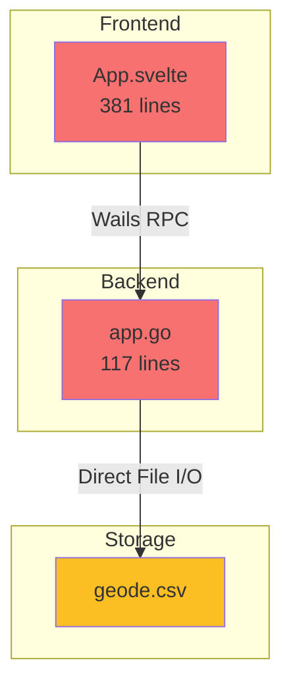
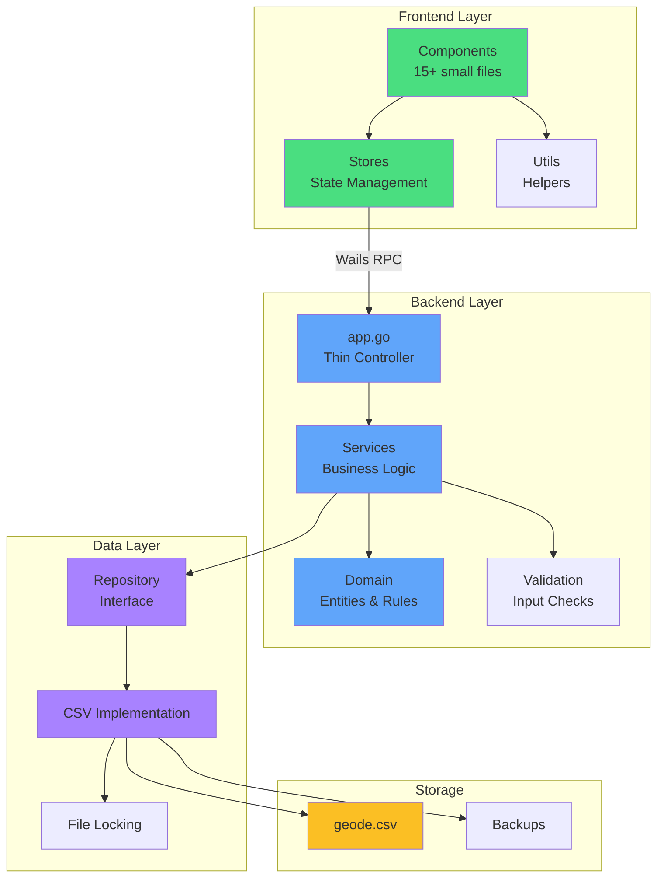
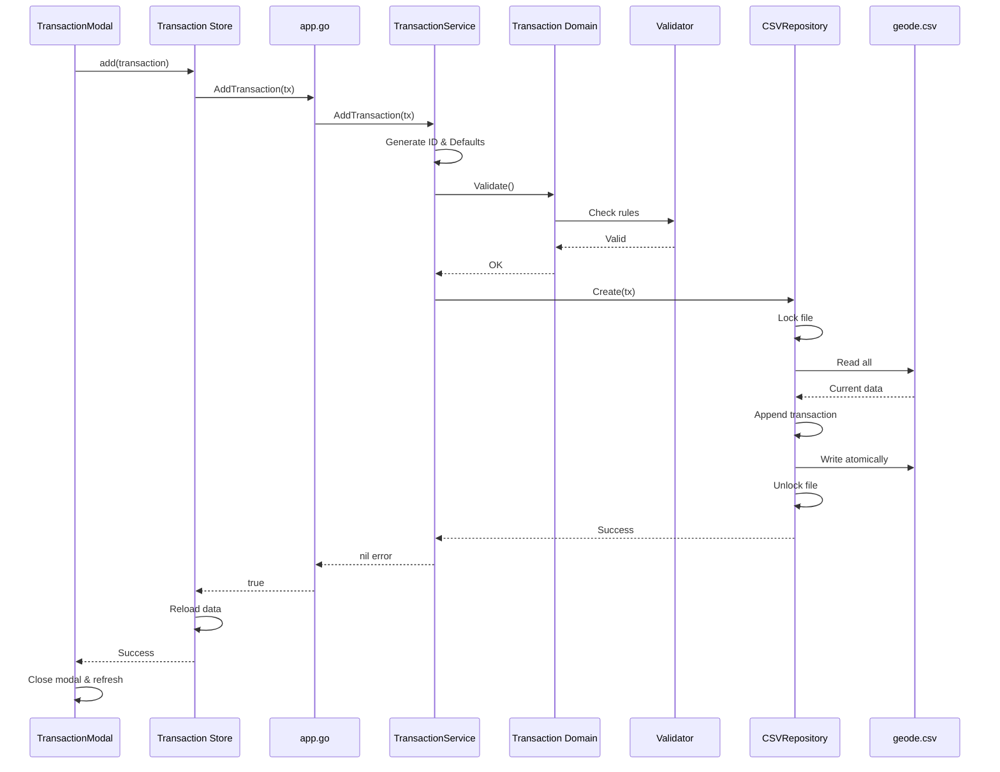
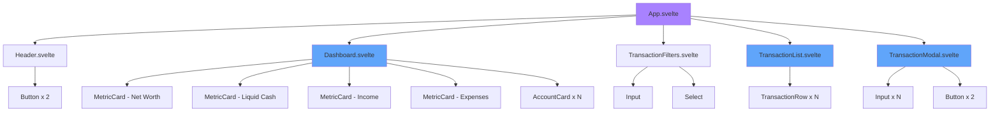

# Geode Vault - Refactoring Plan

## Executive Summary

This document outlines a comprehensive refactoring strategy for the Geode Vault personal finances application. The goal is to transform the current MVP into a scalable, maintainable codebase that supports future features like transaction editing/deletion, search/filtering, and data backup/restore.

## Current State Analysis

### Architecture Overview

- **Framework**: Wails v2 (Go backend + Svelte frontend)
- **Storage**: CSV file (`vault/geode.csv`)
- **Accounting Model**: Double-entry bookkeeping system
- **Current Features**:
  - Add transactions (expense/income/transfer)
  - View transaction ledger
  - Dashboard with metrics (net worth, liquid cash, income, expenses)
  - Account balances (Assets & Liabilities)
  - Auto-complete for accounts and categories

### Identified Issues

#### Backend Issues

1. **Monolithic Structure**: All logic in [`app.go`](app.go:1) - no separation of concerns
2. **No Error Handling**: Functions return boolean instead of proper errors
3. **Direct File I/O**: CSV operations mixed with business logic
4. **No Validation**: Missing input validation and data integrity checks
5. **No Abstraction**: Storage layer tightly coupled to CSV format
6. **Concurrency Issues**: No file locking or concurrent access handling
7. **Missing Features**: No update, delete, search, or backup capabilities

#### Frontend Issues

1. **Monolithic Component**: 380+ lines in single [`App.svelte`](frontend/src/App.svelte:1) file
2. **Mixed Concerns**: UI, state management, and business logic all together
3. **No Component Reuse**: Everything in one file
4. **No State Management**: Reactive statements instead of proper stores
5. **Empty Directories**: `components/`, `stores/`, `style/`, `utils/` exist but unused
6. **Hardcoded Logic**: Account resolution and calculations embedded in UI

#### Data Layer Issues

1. **Fragile Storage**: CSV can be corrupted easily
2. **No Transactions**: Atomic operations not guaranteed
3. **No Backup**: No automated backup mechanism
4. **Limited Queries**: Can't efficiently search or filter
5. **No Versioning**: No schema version tracking

---

## Proposed Architecture

### Backend Architecture (Go)

```
geode/
├── main.go                          # Application entry point
├── app.go                           # Wails app struct (thin controller)
├── internal/
│   ├── domain/                      # Business logic & entities
│   │   ├── transaction.go           # Transaction entity & business rules
│   │   ├── account.go               # Account entity & logic
│   │   └── balance.go               # Balance calculations
│   ├── service/                     # Application services
│   │   ├── transaction_service.go   # Transaction CRUD operations
│   │   ├── account_service.go       # Account management
│   │   ├── balance_service.go       # Balance & metrics calculations
│   │   └── backup_service.go        # Backup/restore operations
│   ├── storage/                     # Data persistence layer
│   │   ├── repository.go            # Repository interface
│   │   ├── csv_repository.go        # CSV implementation
│   │   └── file_lock.go             # File locking utilities
│   ├── validation/                  # Input validation
│   │   └── validator.go             # Validation rules
│   └── errors/                      # Custom error types
│       └── errors.go                # Domain-specific errors
└── vault/                           # Data storage directory
    └── geode.csv
```

#### Layer Responsibilities

**Domain Layer** (`internal/domain/`)

- Define core entities (Transaction, Account)
- Business rules and validation
- Pure Go structs with methods
- No external dependencies

**Service Layer** (`internal/service/`)

- Orchestrate business operations
- Use repositories for data access
- Handle complex workflows
- Return domain errors

**Storage Layer** (`internal/storage/`)

- Abstract data persistence
- Repository pattern for flexibility
- CSV implementation with proper error handling
- File locking for concurrent access

**Validation Layer** (`internal/validation/`)

- Input validation rules
- Data integrity checks
- Reusable validators

**Error Layer** (`internal/errors/`)

- Custom error types
- Error wrapping and context
- User-friendly error messages

### Frontend Architecture (Svelte)

```
frontend/src/
├── App.svelte                       # Main app shell (routing/layout)
├── main.js                          # Entry point
├── components/                      # Reusable UI components
│   ├── layout/
│   │   ├── Header.svelte            # App header with actions
│   │   └── EmptyState.svelte        # Empty state placeholder
│   ├── dashboard/
│   │   ├── Dashboard.svelte         # Dashboard container
│   │   ├── MetricCard.svelte        # Metric display card
│   │   └── AccountCard.svelte       # Account balance card
│   ├── transactions/
│   │   ├── TransactionList.svelte   # Transaction table
│   │   ├── TransactionRow.svelte    # Single transaction row
│   │   ├── TransactionModal.svelte  # Add/Edit modal
│   │   └── TransactionFilters.svelte # Search/filter controls
│   └── common/
│       ├── Button.svelte            # Reusable button
│       ├── Input.svelte             # Form input
│       ├── Select.svelte            # Dropdown select
│       └── Modal.svelte             # Modal wrapper
├── stores/                          # State management
│   ├── transactions.js              # Transaction store
│   ├── accounts.js                  # Account store
│   ├── ui.js                        # UI state (modals, filters)
│   └── settings.js                  # App settings
├── utils/                           # Utility functions
│   ├── formatters.js                # Currency, date formatting
│   ├── calculations.js              # Balance calculations
│   ├── validators.js                # Client-side validation
│   └── account-resolver.js          # Account path resolution
├── style/                           # Shared styles
│   ├── variables.css                # CSS variables
│   ├── theme.css                    # Theme definitions
│   └── global.css                   # Global styles
└── assets/                          # Static assets
```

#### Component Hierarchy

```
App.svelte
├── Header.svelte
├── Dashboard.svelte
│   ├── MetricCard.svelte (x4)
│   └── AccountCard.svelte (xN)
├── TransactionFilters.svelte
├── TransactionList.svelte
│   └── TransactionRow.svelte (xN)
└── TransactionModal.svelte
    ├── Input.svelte (xN)
    └── Button.svelte (x2)
```

---

## Refactoring Strategy

### Phase 1: Backend Foundation

#### 1.1 Create Domain Models

- Extract [`Transaction`](app.go:25) struct to `internal/domain/transaction.go`
- Add validation methods
- Add business logic methods
- Create Account domain model
- Create Balance calculation model

#### 1.2 Implement Storage Layer

- Create repository interface in `internal/storage/repository.go`
- Implement CSV repository with proper error handling
- Add file locking mechanism
- Add atomic write operations (write to temp, then rename)
- Add data validation on read/write

#### 1.3 Build Service Layer

- Create TransactionService with CRUD operations
- Create AccountService for account management
- Create BalanceService for calculations
- Create BackupService for backup/restore
- Implement proper error handling and logging

#### 1.4 Create Error Handling

- Define custom error types in `internal/errors/`
- Add error wrapping with context
- Create user-friendly error messages

#### 1.5 Add Validation Layer

- Create validation rules for transactions
- Add input sanitization
- Validate account paths
- Validate amounts and dates

#### 1.6 Refactor app.go

- Make it a thin controller
- Delegate to services
- Return proper errors to frontend
- Add context handling

### Phase 2: Frontend Foundation

#### 2.1 Setup State Management

- Create transaction store with Svelte stores
- Create account store
- Create UI state store
- Implement reactive subscriptions

#### 2.2 Extract Utility Functions

- Move formatters to `utils/formatters.js`
- Move calculations to `utils/calculations.js`
- Move account resolver to `utils/account-resolver.js`
- Add client-side validators

#### 2.3 Create Style System

- Extract CSS variables to `style/variables.css`
- Create theme system in `style/theme.css`
- Move global styles to `style/global.css`
- Remove inline styles from components

#### 2.4 Build Common Components

- Create Button component
- Create Input component
- Create Modal wrapper
- Create Select/Autocomplete component

### Phase 3: Component Extraction

#### 3.1 Layout Components

- Extract Header from [`App.svelte`](frontend/src/App.svelte:141)
- Create EmptyState component

#### 3.2 Dashboard Components

- Extract Dashboard section
- Create MetricCard component
- Create AccountCard component

#### 3.3 Transaction Components

- Extract TransactionList
- Create TransactionRow component
- Extract TransactionModal
- Create TransactionFilters component

#### 3.4 Refactor App.svelte

- Keep only layout and routing
- Use extracted components
- Subscribe to stores
- Remove business logic

### Phase 4: New Features

#### 4.1 Transaction Management

- Add UpdateTransaction backend method
- Add DeleteTransaction backend method
- Add transaction editing UI
- Add delete confirmation modal
- Update stores to handle edits/deletes

#### 4.2 Search & Filtering

- Add search/filter methods in service layer
- Create filter UI component
- Add date range filtering
- Add account/category filtering
- Add amount range filtering
- Add tag filtering

#### 4.3 Backup & Restore

- Implement backup service
- Add automatic backup on changes
- Create backup UI
- Add restore functionality
- Add export to different formats

### Phase 5: Quality & Polish

#### 5.1 Error Handling

- Add error boundaries in frontend
- Show user-friendly error messages
- Add retry mechanisms
- Log errors properly

#### 5.2 Testing

- Add unit tests for domain logic
- Add service layer tests
- Add repository tests
- Add component tests

#### 5.3 Documentation

- Document API methods
- Add code comments
- Create user documentation
- Add architecture diagrams

#### 5.4 Performance

- Add pagination for large datasets
- Optimize calculations
- Add caching where appropriate
- Lazy load components

---

## Implementation Details

### Backend: Repository Pattern

```go
// internal/storage/repository.go
type Repository interface {
    // Transaction operations
    Create(tx *domain.Transaction) error
    GetAll() ([]*domain.Transaction, error)
    GetByID(id string) (*domain.Transaction, error)
    Update(tx *domain.Transaction) error
    Delete(id string) error

    // Query operations
    Search(filters *SearchFilters) ([]*domain.Transaction, error)

    // Backup operations
    Backup(path string) error
    Restore(path string) error
}

// internal/storage/csv_repository.go
type CSVRepository struct {
    filePath string
    mu       sync.RWMutex
}

func (r *CSVRepository) Create(tx *domain.Transaction) error {
    r.mu.Lock()
    defer r.mu.Unlock()

    // Validate transaction
    if err := tx.Validate(); err != nil {
        return errors.Wrap(err, "invalid transaction")
    }

    // Read existing data
    transactions, err := r.readAll()
    if err != nil {
        return err
    }

    // Append new transaction
    transactions = append(transactions, tx)

    // Write atomically
    return r.writeAll(transactions)
}
```

### Backend: Service Layer

```go
// internal/service/transaction_service.go
type TransactionService struct {
    repo storage.Repository
}

func NewTransactionService(repo storage.Repository) *TransactionService {
    return &TransactionService{repo: repo}
}

func (s *TransactionService) AddTransaction(tx *domain.Transaction) error {
    // Auto-generate ID if missing
    if tx.ID == "" {
        tx.ID = generateID()
    }

    // Set defaults
    if tx.Status == "" {
        tx.Status = "cleared"
    }

    if tx.Currency == "" {
        tx.Currency = "BRL"
    }

    // Validate
    if err := tx.Validate(); err != nil {
        return errors.NewValidationError(err.Error())
    }

    // Persist
    return s.repo.Create(tx)
}

func (s *TransactionService) UpdateTransaction(tx *domain.Transaction) error {
    // Check if exists
    existing, err := s.repo.GetByID(tx.ID)
    if err != nil {
        return err
    }
    if existing == nil {
        return errors.NewNotFoundError("transaction not found")
    }

    // Validate
    if err := tx.Validate(); err != nil {
        return errors.NewValidationError(err.Error())
    }

    // Update
    return s.repo.Update(tx)
}
```

### Frontend: Store Pattern

```javascript
// stores/transactions.js
import { writable, derived } from "svelte/store";
import {
  GetTransactions,
  AddTransaction,
  UpdateTransaction,
  DeleteTransaction,
} from "../wailsjs/go/main/App.js";

function createTransactionStore() {
  const { subscribe, set, update } = writable([]);

  return {
    subscribe,

    async load() {
      const transactions = await GetTransactions();
      set(transactions);
    },

    async add(transaction) {
      const success = await AddTransaction(transaction);
      if (success) {
        await this.load();
      }
      return success;
    },

    async update(transaction) {
      const success = await UpdateTransaction(transaction);
      if (success) {
        await this.load();
      }
      return success;
    },

    async delete(id) {
      const success = await DeleteTransaction(id);
      if (success) {
        await this.load();
      }
      return success;
    },
  };
}

export const transactions = createTransactionStore();

// Derived stores for calculations
export const accountBalances = derived(transactions, ($transactions) => {
  return $transactions.reduce((acc, tx) => {
    if (!acc[tx.destination]) acc[tx.destination] = 0;
    acc[tx.destination] += tx.amount;

    if (!acc[tx.source]) acc[tx.source] = 0;
    acc[tx.source] -= tx.amount;

    return acc;
  }, {});
});
```

### Frontend: Component Example

```svelte
<!-- components/dashboard/MetricCard.svelte -->
<script>
    export let title;
    export let value;
    export let currency = 'BRL';
    export let variant = 'default'; // 'default', 'cash', 'income', 'expenses'
</script>

<div class="metric-card {variant}">
    <h3>{title}</h3>
    <p class="value">
        {currency} {value.toFixed(2)}
    </p>
</div>

<style>
    .metric-card {
        background: var(--card-bg);
        padding: var(--spacing-lg);
        border-radius: var(--radius-lg);
        border: 1px solid var(--border-color);
    }

    .metric-card h3 {
        margin: 0 0 var(--spacing-sm) 0;
        font-size: var(--font-size-sm);
        color: var(--text-muted);
        text-transform: uppercase;
        letter-spacing: 1px;
    }

    .value {
        margin: 0;
        font-size: var(--font-size-2xl);
        font-weight: 800;
        letter-spacing: -1px;
    }

    .metric-card.cash .value { color: var(--color-cash); }
    .metric-card.income .value { color: var(--color-income); }
    .metric-card.expenses .value { color: var(--color-expenses); }
</style>
```

---

## Migration Strategy

### Approach: Incremental Refactoring

We'll use the **Strangler Fig Pattern** - gradually replace parts of the monolith while keeping the app functional.

### Step-by-Step Migration

1. **Create new structure alongside old code**
   - Don't delete existing code immediately
   - Build new architecture in parallel
   - Test thoroughly before switching

2. **Backend Migration**
   - Create domain models
   - Implement repository with CSV backend
   - Build services
   - Update app.go to use services
   - Keep old methods as fallback initially

3. **Frontend Migration**
   - Extract utilities first (no UI changes)
   - Create stores (can coexist with reactive statements)
   - Build components one section at a time
   - Replace sections in App.svelte incrementally
   - Test each component before moving to next

4. **Feature Addition**
   - Add new features using new architecture
   - Proves the architecture works
   - Builds confidence in the refactoring

5. **Cleanup**
   - Remove old code once new code is stable
   - Update documentation
   - Final testing

### Risk Mitigation

1. **Data Safety**
   - Backup CSV before any changes
   - Test with copy of data first
   - Implement backup service early

2. **Functionality Preservation**
   - Test each change thoroughly
   - Keep old code until new code is proven
   - Use feature flags if needed

3. **Rollback Plan**
   - Git commits at each step
   - Tag stable versions
   - Document rollback procedures

---

## File Structure Comparison

### Before

```
geode/
├── app.go (117 lines - everything)
├── main.go
├── frontend/src/
│   ├── App.svelte (381 lines - everything)
│   ├── components/ (empty)
│   ├── stores/ (empty)
│   └── utils/ (empty)
└── internal/ (empty directories)
```

### After

```
geode/
├── app.go (~50 lines - thin controller)
├── main.go
├── internal/
│   ├── domain/
│   │   ├── transaction.go
│   │   ├── account.go
│   │   └── balance.go
│   ├── service/
│   │   ├── transaction_service.go
│   │   ├── account_service.go
│   │   ├── balance_service.go
│   │   └── backup_service.go
│   ├── storage/
│   │   ├── repository.go
│   │   ├── csv_repository.go
│   │   └── file_lock.go
│   ├── validation/
│   │   └── validator.go
│   └── errors/
│       └── errors.go
└── frontend/src/
    ├── App.svelte (~100 lines - layout only)
    ├── components/ (15+ components)
    ├── stores/ (4 stores)
    ├── utils/ (4 utility files)
    └── style/ (3 style files)
```

---

## Benefits of Refactoring

### Maintainability

- **Single Responsibility**: Each file has one clear purpose
- **Easy to Find**: Logical organization makes code easy to locate
- **Easy to Test**: Small, focused units are easier to test
- **Easy to Change**: Changes are isolated to specific areas

### Scalability

- **Add Features Easily**: New features fit into existing structure
- **Parallel Development**: Multiple developers can work simultaneously
- **Performance**: Can optimize specific layers independently
- **Flexibility**: Can swap implementations (e.g., CSV → SQLite later)

### Code Quality

- **Error Handling**: Proper error propagation and handling
- **Validation**: Consistent validation across the app
- **Type Safety**: Better use of Go's type system
- **Reusability**: Components and utilities can be reused

### Developer Experience

- **Clear Architecture**: New developers understand structure quickly
- **Documentation**: Code is self-documenting through organization
- **Debugging**: Easier to trace issues through layers
- **Confidence**: Tests and structure give confidence to make changes

---

## Next Steps

1. **Review this plan** - Discuss and adjust based on your feedback
2. **Prioritize phases** - Decide which phases to tackle first
3. **Set up development environment** - Ensure testing environment is ready
4. **Create backup** - Backup current code and data
5. **Start implementation** - Begin with Phase 1.1 (Domain Models)

---

## Mermaid Diagrams

### Current Architecture



### Proposed Architecture



### Data Flow - Add Transaction



### Component Hierarchy



---

## Conclusion

This refactoring plan transforms Geode Vault from a functional MVP into a scalable, maintainable application. The incremental approach minimizes risk while delivering immediate benefits. Each phase builds on the previous one, creating a solid foundation for future features.

The proposed architecture follows industry best practices:

- **Separation of Concerns**: Clear boundaries between layers
- **SOLID Principles**: Single responsibility, dependency inversion
- **Repository Pattern**: Abstract data access
- **Component-Based UI**: Reusable, testable components
- **State Management**: Centralized, predictable state

By following this plan, you'll have a codebase that's:

- Easy to understand and navigate
- Simple to test and debug
- Ready for new features
- Maintainable for the long term
