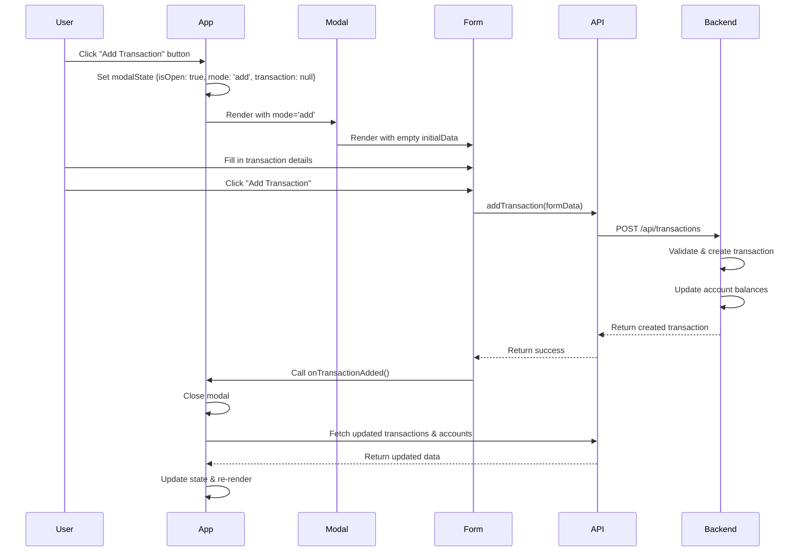
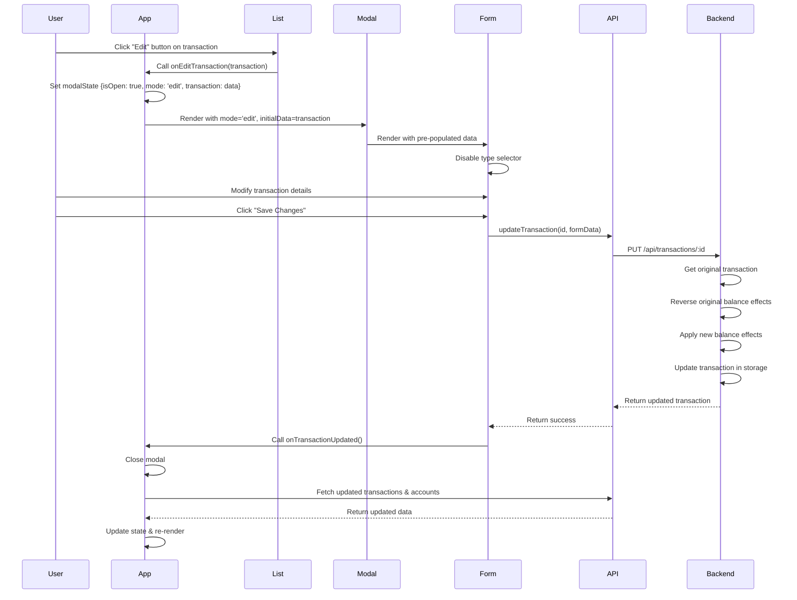

# Transaction Modal & Edit Functionality - Technical Design Document

## Executive Summary

This document outlines the technical design for converting the inline transaction form to a modal-based system with full edit functionality and date field support. The design maintains the existing discriminated union type system while adding new capabilities for updating transactions.

---

## 1. Modal Architecture

### 1.1 Component Structure

```
TransactionModal (new component)
├── Modal Overlay (backdrop)
├── Modal Container
│   ├── Modal Header
│   │   ├── Title (dynamic: "Add Transaction" / "Edit Transaction")
│   │   └── Close Button (X)
│   ├── Modal Body
│   │   └── TransactionForm (refactored, reusable)
│   └── Modal Footer (optional, for additional actions)
```

### 1.2 File Structure

**New Files:**

- `frontend/src/components/TransactionModal.tsx` - Modal wrapper component
- `frontend/src/components/TransactionModal.css` - Modal-specific styles
- `frontend/src/hooks/useModal.ts` - Custom hook for modal state management (optional)

**Modified Files:**

- `frontend/src/components/TransactionForm.tsx` - Refactored to be mode-agnostic
- `frontend/src/components/TransactionForm.css` - Updated for modal context
- `frontend/src/components/TransactionList.tsx` - Add edit buttons
- `frontend/src/App.tsx` - Integrate modal trigger
- `frontend/src/services/api.ts` - Add update method
- `frontend/src/types/index.ts` - Add new types

**Backend Files:**

- `backend/handlers/transactions.go` - Add PUT/PATCH handler
- `backend/services/ledger.go` - Add update transaction logic

### 1.3 Modal Trigger Mechanisms

**Add Transaction:**

- Button in the UI (replace inline form)
- Location: Top of left column or floating action button
- Action: Opens modal in "add" mode with empty form

**Edit Transaction:**

- Edit button/icon in each transaction row
- Location: New column in transaction table
- Action: Opens modal in "edit" mode with pre-populated data

### 1.4 Modal State Management

**State Variables:**

```typescript
interface ModalState {
  isOpen: boolean;
  mode: "add" | "edit";
  transaction: Transaction | null; // null for add, populated for edit
}
```

**State Location:**

- Managed in `App.tsx` (parent component)
- Passed down to modal via props
- Alternative: Context API for complex scenarios

### 1.5 Close Mechanisms

1. **X Button:** Click handler on close icon
2. **ESC Key:** `useEffect` with keyboard event listener
3. **Backdrop Click:** Click handler on overlay (outside modal content)
4. **Successful Submission:** Auto-close after successful add/edit
5. **Cancel Button:** Explicit cancel action in form

**Implementation Pattern:**

```typescript
const handleClose = () => {
  if (hasUnsavedChanges) {
    if (confirm("Discard unsaved changes?")) {
      closeModal();
    }
  } else {
    closeModal();
  }
};
```

---

## 2. Form Mode Management

### 2.1 Mode Differentiation

**Props Interface:**

```typescript
interface TransactionFormProps {
  accounts: Account[];
  mode: "add" | "edit";
  initialData?: Transaction; // Required when mode is 'edit'
  onSubmit: (data: TransactionFormData) => Promise<void>;
  onCancel: () => void;
}
```

### 2.2 Form Initialization Logic

```typescript
const initializeFormData = (
  mode: "add" | "edit",
  initialData?: Transaction,
): TransactionFormData => {
  if (mode === "edit" && initialData) {
    // Convert Transaction to TransactionFormData
    return transactionToFormData(initialData);
  }

  // Default for add mode
  return {
    type: "purchase",
    amount: "",
    account: "",
    category: "",
    description: "",
  };
};
```

### 2.3 Transaction to Form Data Conversion

```typescript
const transactionToFormData = (
  transaction: Transaction,
): TransactionFormData => {
  const base = {
    amount: transaction.amount.toString(),
    description: transaction.description,
  };

  if (transaction.type === "transfer") {
    return {
      type: "transfer",
      ...base,
      from_account: transaction.from_account,
      to_account: transaction.to_account,
    };
  } else {
    return {
      type: transaction.type,
      ...base,
      account: transaction.account,
      category: transaction.category,
    };
  }
};
```

### 2.4 Dynamic Form Title

```typescript
const formTitle = mode === "add" ? "Add Transaction" : "Edit Transaction";
const submitButtonText =
  mode === "add"
    ? loading
      ? "Adding..."
      : "Add Transaction"
    : loading
      ? "Saving..."
      : "Save Changes";
```

### 2.5 Type Change Restrictions

**Add Mode:** Allow type changes (current behavior)
**Edit Mode:** Disable type selector to prevent complex state transitions

```typescript
<select
  id="type"
  value={formData.type}
  onChange={(e) => handleTypeChange(e.target.value as TransactionType)}
  disabled={mode === 'edit'}
  required
>
```

---

## 3. Date Field Integration

### 3.1 Date Input Field

**Field Type:** `<input type="datetime-local">`

**Rationale:**

- Provides native date/time picker
- Returns ISO 8601 format string
- Good browser support
- Accessible

**Alternative:** `<input type="date">` for date-only (simpler, recommended)

### 3.2 Updated Type Definitions

```typescript
// Update TransactionFormData to include date
export type TransactionFormData =
  | {
      type: "purchase";
      amount: string;
      account: string;
      category: string;
      description: string;
      date: string; // ISO 8601 date string
    }
  | {
      type: "earning";
      amount: string;
      account: string;
      category: string;
      description: string;
      date: string;
    }
  | {
      type: "transfer";
      amount: string;
      from_account: string;
      to_account: string;
      description: string;
      date: string;
    };
```

### 3.3 Default Date Behavior

**Add Mode:**

```typescript
const getDefaultDate = (): string => {
  const now = new Date();
  // Format for datetime-local: YYYY-MM-DDTHH:mm
  return now.toISOString().slice(0, 16);
};
```

**Edit Mode:**

```typescript
const getEditDate = (transaction: Transaction): string => {
  const date = new Date(transaction.timestamp);
  return date.toISOString().slice(0, 16);
};
```

### 3.4 Form Field Implementation

```typescript
<div className="form-group">
  <label htmlFor="date">Date & Time</label>
  <input
    id="date"
    type="datetime-local"
    value={formData.date}
    onChange={(e) => setFormData({ ...formData, date: e.target.value })}
    max={new Date().toISOString().slice(0, 16)} // Prevent future dates
    required
  />
</div>
```

### 3.5 Date Validation

**Client-side:**

- Required field
- Cannot be in the future
- Must be valid date format

**Server-side:**

- Parse and validate date string
- Ensure date is not in the future
- Handle timezone conversions properly

### 3.6 Date Submission Format

**Frontend to Backend:**

```typescript
// In api.ts addTransaction/updateTransaction
const payload = {
  ...otherFields,
  date: new Date(formData.date).toISOString(), // Full ISO 8601 with timezone
};
```

**Backend Processing:**

```go
// In Go, parse the date
parsedDate, err := time.Parse(time.RFC3339, dateString)
if err != nil {
    return nil, errors.New("invalid date format")
}
transaction.Date = parsedDate
```

---

## 4. Backend API Changes

### 4.1 New Endpoint Specification

**Endpoint:** `PUT /api/transactions/:id`

**Method:** PUT (full update) or PATCH (partial update)

- **Recommendation:** Use PUT for simplicity (full replacement)

**URL Pattern:** `/api/transactions/{transaction_id}`

**Request Headers:**

```
Content-Type: application/json
```

**Request Body:**

```json
{
  "type": "purchase",
  "amount": 150.0,
  "account": "Checking",
  "category": "Groceries",
  "description": "Weekly shopping",
  "date": "2026-03-26T15:30:00Z"
}
```

**Success Response (200 OK):**

```json
{
  "id": "123e4567-e89b-12d3-a456-426614174000",
  "type": "purchase",
  "amount": 150.0,
  "account": "Checking",
  "category": "Groceries",
  "description": "Weekly shopping",
  "timestamp": "2026-03-26T15:30:00Z"
}
```

**Error Responses:**

- **400 Bad Request:** Invalid data

```json
{
  "error": "amount must be greater than 0"
}
```

- **404 Not Found:** Transaction doesn't exist

```json
{
  "error": "transaction not found"
}
```

- **409 Conflict:** Update would cause invalid state

```json
{
  "error": "insufficient funds in account"
}
```

### 4.2 Handler Implementation

**File:** `backend/handlers/transactions.go`

```go
// UpdateTransaction handles PUT /api/transactions/:id
func (h *TransactionHandler) UpdateTransaction(w http.ResponseWriter, r *http.Request) {
    if r.Method != http.MethodPut {
        http.Error(w, "Method not allowed", http.StatusMethodNotAllowed)
        return
    }

    // Extract ID from URL
    id := r.URL.Path[len("/api/transactions/"):]
    if id == "" {
        http.Error(w, "Transaction ID required", http.StatusBadRequest)
        return
    }

    var updatedTransaction models.Transaction
    if err := json.NewDecoder(r.Body).Decode(&updatedTransaction); err != nil {
        log.Printf("Error decoding transaction: %v", err)
        http.Error(w, "Invalid request body", http.StatusBadRequest)
        return
    }

    // Ensure ID matches URL
    updatedTransaction.ID = id

    result, err := h.ledger.UpdateTransaction(&updatedTransaction)
    if err != nil {
        log.Printf("Error updating transaction: %v", err)
        // Determine appropriate status code
        if err.Error() == "transaction not found" {
            http.Error(w, err.Error(), http.StatusNotFound)
        } else {
            http.Error(w, err.Error(), http.StatusBadRequest)
        }
        return
    }

    w.Header().Set("Content-Type", "application/json")
    json.NewEncoder(w).Encode(result)
    log.Printf("Transaction updated: %s", result.ID)
}
```

### 4.3 Service Layer Logic

**File:** `backend/services/ledger.go`

```go
// UpdateTransaction updates an existing transaction
func (s *LedgerService) UpdateTransaction(updated *models.Transaction) (*models.Transaction, error) {
    // Validate the updated transaction
    if err := updated.Validate(); err != nil {
        return nil, err
    }

    // Get the original transaction
    original, err := s.storage.GetTransactionByID(updated.ID)
    if err != nil {
        return nil, err
    }
    if original == nil {
        return nil, errors.New("transaction not found")
    }

    // Reverse the original transaction's effect on account balances
    if err := s.reverseAccountBalances(original); err != nil {
        return nil, err
    }

    // Apply the updated transaction's effect on account balances
    if err := s.updateAccountBalances(updated); err != nil {
        // If this fails, try to restore original state
        s.updateAccountBalances(original)
        return nil, err
    }

    // Update the transaction in storage
    if err := s.storage.UpdateTransaction(updated); err != nil {
        // Rollback balance changes
        s.reverseAccountBalances(updated)
        s.updateAccountBalances(original)
        return nil, err
    }

    return updated, nil
}

// reverseAccountBalances reverses the effect of a transaction on account balances
func (s *LedgerService) reverseAccountBalances(transaction *models.Transaction) error {
    switch transaction.Type {
    case models.TransactionTypePurchase:
        // Reverse: add money back to account
        if transaction.Account != nil && *transaction.Account != "" {
            if err := s.adjustAccountBalance(*transaction.Account, transaction.Amount); err != nil {
                return err
            }
        }

    case models.TransactionTypeEarning:
        // Reverse: remove money from account
        if transaction.Account != nil && *transaction.Account != "" {
            if err := s.adjustAccountBalance(*transaction.Account, -transaction.Amount); err != nil {
                return err
            }
        }

    case models.TransactionTypeTransfer:
        // Reverse: add back to from_account, remove from to_account
        if transaction.FromAccount != nil && *transaction.FromAccount != "" {
            if err := s.adjustAccountBalance(*transaction.FromAccount, transaction.Amount); err != nil {
                return err
            }
        }
        if transaction.ToAccount != nil && *transaction.ToAccount != "" {
            if err := s.adjustAccountBalance(*transaction.ToAccount, -transaction.Amount); err != nil {
                return err
            }
        }
    }

    return nil
}
```

### 4.4 Storage Layer Update

**File:** `backend/storage/storage.go`

Add interface method:

```go
type Storage interface {
    // ... existing methods ...
    UpdateTransaction(transaction *models.Transaction) error
}
```

**File:** `backend/storage/json_storage.go`

Implement the method:

```go
func (s *JSONStorage) UpdateTransaction(transaction *models.Transaction) error {
    s.mu.Lock()
    defer s.mu.Unlock()

    // Find and update the transaction
    found := false
    for i, t := range s.transactions {
        if t.ID == transaction.ID {
            s.transactions[i] = transaction
            found = true
            break
        }
    }

    if !found {
        return errors.New("transaction not found")
    }

    return s.saveTransactions()
}
```

### 4.5 Route Registration

**File:** `backend/main.go`

```go
// Add to existing routes
http.HandleFunc("/api/transactions/", func(w http.ResponseWriter, r *http.Request) {
    // Check if it's a specific transaction (has ID)
    id := r.URL.Path[len("/api/transactions/"):]

    if id != "" {
        // Routes for specific transaction
        switch r.Method {
        case http.MethodGet:
            transactionHandler.GetTransactionByID(w, r)
        case http.MethodPut:
            transactionHandler.UpdateTransaction(w, r)
        default:
            http.Error(w, "Method not allowed", http.StatusMethodNotAllowed)
        }
    } else {
        // Routes for transaction collection
        switch r.Method {
        case http.MethodGet:
            transactionHandler.GetAllTransactions(w, r)
        case http.MethodPost:
            transactionHandler.CreateTransaction(w, r)
        default:
            http.Error(w, "Method not allowed", http.StatusMethodNotAllowed)
        }
    }
})
```

---

## 5. Frontend API Service Updates

### 5.1 New API Method

**File:** `frontend/src/services/api.ts`

```typescript
async updateTransaction(
  id: string,
  data: TransactionFormData
): Promise<Transaction> {
  let payload: any = {
    type: data.type,
    amount: parseFloat(data.amount),
    description: data.description,
    date: new Date(data.date).toISOString(),
  };

  // Add type-specific fields
  if (data.type === "transfer") {
    payload.from_account = data.from_account;
    payload.to_account = data.to_account;
  } else {
    payload.account = data.account;
    payload.category = data.category;
  }

  const response = await fetch(`${API_BASE_URL}/transactions/${id}`, {
    method: "PUT",
    headers: {
      "Content-Type": "application/json",
    },
    body: JSON.stringify(payload),
  });

  return this.handleResponse<Transaction>(response);
}
```

### 5.2 Updated Type Definitions

**File:** `frontend/src/types/index.ts`

```typescript
// Add date field to Transaction types
interface BaseTransaction {
  id: string;
  amount: number;
  description: string;
  timestamp: string; // Keep for backward compatibility
  date?: string; // New field for user-specified date
}

// Update TransactionFormData (shown in section 3.2)
```

---

## 6. Transaction List Integration

### 6.1 Add Edit Buttons

**File:** `frontend/src/components/TransactionList.tsx`

**Table Structure Update:**

```typescript
<thead>
  <tr>
    <th>Date</th>
    <th>Type</th>
    <th>Description</th>
    <th>Account/From</th>
    <th>Category/To</th>
    <th className="amount-column">Amount</th>
    <th className="actions-column">Actions</th> {/* New column */}
  </tr>
</thead>
```

**Row Implementation:**

```typescript
<tbody>
  {transactions.map((transaction) => (
    <tr key={transaction.id}>
      {/* ... existing cells ... */}
      <td className="actions-cell">
        <button
          className="edit-button"
          onClick={() => onEditTransaction(transaction)}
          aria-label={`Edit transaction: ${transaction.description}`}
        >
          <EditIcon />
          Edit
        </button>
      </td>
    </tr>
  ))}
</tbody>
```

### 6.2 Props Update

```typescript
interface TransactionListProps {
  transactions: Transaction[];
  onEditTransaction: (transaction: Transaction) => void; // New prop
}
```

### 6.3 Edit Button Styling

**File:** `frontend/src/components/TransactionList.css`

```css
.actions-column {
  width: 100px;
  text-align: center;
}

.actions-cell {
  padding: 8px;
}

.edit-button {
  display: inline-flex;
  align-items: center;
  gap: 4px;
  padding: 6px 12px;
  background: #2a2a2a;
  border: 1px solid #3a3a3a;
  border-radius: 4px;
  color: #4a9eff;
  font-size: 0.85rem;
  cursor: pointer;
  transition: all 0.2s;
}

.edit-button:hover {
  background: #3a3a3a;
  border-color: #4a9eff;
}

.edit-button svg {
  width: 14px;
  height: 14px;
}
```

### 6.4 Refresh Behavior

**After Edit:**

- Call `onTransactionUpdated()` callback
- Parent component (`App.tsx`) refetches all data
- Transaction list re-renders with updated data
- Accounts list updates with new balances

---

## 7. Component Interaction Flow

### 7.1 Add Transaction Flow



### 7.2 Edit Transaction Flow



### 7.3 State Management Flow

**App.tsx State:**

```typescript
const [modalState, setModalState] = useState<{
  isOpen: boolean;
  mode: "add" | "edit";
  transaction: Transaction | null;
}>({
  isOpen: false,
  mode: "add",
  transaction: null,
});

const openAddModal = () => {
  setModalState({ isOpen: true, mode: "add", transaction: null });
};

const openEditModal = (transaction: Transaction) => {
  setModalState({ isOpen: true, mode: "edit", transaction });
};

const closeModal = () => {
  setModalState({ isOpen: false, mode: "add", transaction: null });
};
```

---

## 8. Styling Considerations

### 8.1 Modal-Specific CSS

**File:** `frontend/src/components/TransactionModal.css`

```css
/* Modal Overlay */
.modal-overlay {
  position: fixed;
  top: 0;
  left: 0;
  right: 0;
  bottom: 0;
  background: rgba(0, 0, 0, 0.7);
  display: flex;
  align-items: center;
  justify-content: center;
  z-index: 1000;
  padding: 20px;
  animation: fadeIn 0.2s ease-out;
}

@keyframes fadeIn {
  from {
    opacity: 0;
  }
  to {
    opacity: 1;
  }
}

/* Modal Container */
.modal-container {
  background: #1e1e1e;
  border-radius: 8px;
  box-shadow: 0 4px 24px rgba(0, 0, 0, 0.5);
  max-width: 600px;
  width: 100%;
  max-height: 90vh;
  overflow-y: auto;
  animation: slideUp 0.3s ease-out;
}

@keyframes slideUp {
  from {
    transform: translateY(20px);
    opacity: 0;
  }
  to {
    transform: translateY(0);
    opacity: 1;
  }
}

/* Modal Header */
.modal-header {
  display: flex;
  justify-content: space-between;
  align-items: center;
  padding: 20px 24px;
  border-bottom: 1px solid #3a3a3a;
}

.modal-title {
  margin: 0;
  color: #e0e0e0;
  font-size: 1.5rem;
}

.modal-close-button {
  background: none;
  border: none;
  color: #b0b0b0;
  font-size: 1.5rem;
  cursor: pointer;
  padding: 4px 8px;
  line-height: 1;
  transition: color 0.2s;
}

.modal-close-button:hover {
  color: #e0e0e0;
}

/* Modal Body */
.modal-body {
  padding: 24px;
}

/* Modal Footer (optional) */
.modal-footer {
  padding: 16px 24px;
  border-top: 1px solid #3a3a3a;
  display: flex;
  justify-content: flex-end;
  gap: 12px;
}
```

### 8.2 Responsive Design

```css
/* Mobile Adjustments */
@media (max-width: 768px) {
  .modal-overlay {
    padding: 0;
  }

  .modal-container {
    max-width: 100%;
    max-height: 100vh;
    border-radius: 0;
    height: 100vh;
  }

  .modal-header {
    padding: 16px;
  }

  .modal-body {
    padding: 16px;
  }

  .modal-title {
    font-size: 1.25rem;
  }
}

/* Tablet Adjustments */
@media (min-width: 769px) and (max-width: 1024px) {
  .modal-container {
    max-width: 500px;
  }
}
```

### 8.3 Accessibility (ARIA)

**Modal Component:**

```typescript
<div
  className="modal-overlay"
  role="dialog"
  aria-modal="true"
  aria-labelledby="modal-title"
  onClick={handleBackdropClick}
>
  <div className="modal-container" onClick={(e) => e.stopPropagation()}>
    <div className="modal-header">
      <h2 id="modal-title" className="modal-title">
        {mode === 'add' ? 'Add Transaction' : 'Edit Transaction'}
      </h2>
      <button
        className="modal-close-button"
        onClick={onClose}
        aria-label="Close modal"
      >
        ×
      </button>
    </div>
    <div className="modal-body">
      {/* Form content */}
    </div>
  </div>
</div>
```

### 8.4 Focus Management

**Focus Trap Implementation:**

```typescript
useEffect(() => {
  if (isOpen) {
    // Store previously focused element
    const previouslyFocused = document.activeElement as HTMLElement;

    // Focus first input in modal
    const firstInput = modalRef.current?.querySelector(
      "input, select, textarea",
    );
    (firstInput as HTMLElement)?.focus();

    // Return focus on unmount
    return () => {
      previouslyFocused?.focus();
    };
  }
}, [isOpen]);
```

**Keyboard Navigation:**

```typescript
useEffect(() => {
  const handleKeyDown = (e: KeyboardEvent) => {
    if (e.key === "Escape") {
      onClose();
    }

    // Tab trap logic
    if (e.key === "Tab") {
      const focusableElements = modalRef.current?.querySelectorAll(
        'button, input, select, textarea, [tabindex]:not([tabindex="-1"])',
      );

      if (focusableElements && focusableElements.length > 0) {
        const firstElement = focusableElements[0] as HTMLElement;
        const lastElement = focusableElements[
          focusableElements.length - 1
        ] as HTMLElement;

        if (e.shiftKey && document.activeElement === firstElement) {
          e.preventDefault();
          lastElement.focus();
        } else if (!e.shiftKey && document.activeElement === lastElement) {
          e.preventDefault();
          firstElement.focus();
        }
      }
    }
  };

  if (isOpen) {
    document.addEventListener("keydown", handleKeyDown);
    return () => document.removeEventListener("keydown", handleKeyDown);
  }
}, [isOpen, onClose]);
```

### 8.5 Body Scroll Lock

**Prevent background scrolling when modal is open:**

```typescript
useEffect(() => {
  if (isOpen) {
    document.body.style.overflow = "hidden";
    return () => {
      document.body.style.overflow = "unset";
    };
  }
}, [isOpen]);
```

---

## 9. Implementation Checklist

### Phase 1: Backend Foundation

- [ ] Add `UpdateTransaction` method to `storage.Storage` interface
- [ ] Implement `UpdateTransaction` in `json_storage.go`
- [ ] Add `reverseAccountBalances` helper to `ledger.go`
- [ ] Implement `UpdateTransaction` service method in `ledger.go`
- [ ] Add `UpdateTransaction` handler in `transactions.go`
- [ ] Update route registration in `main.go`
- [ ] Test backend update endpoint with curl/Postman

### Phase 2: Frontend Types & API

- [ ] Update `TransactionFormData` type to include `date` field
- [ ] Add `updateTransaction` method to `api.ts`
- [ ] Test API service method

### Phase 3: Modal Infrastructure

- [ ] Create `TransactionModal.tsx` component
- [ ] Create `TransactionModal.css` with overlay, container, animations
- [ ] Implement close mechanisms (X, ESC, backdrop)
- [ ] Add focus management and keyboard navigation
- [ ] Add body scroll lock

### Phase 4: Form Refactoring

- [ ] Update `TransactionForm` props to accept `mode` and `initialData`
- [ ] Add date input field to form
- [ ] Implement form initialization logic for add/edit modes
- [ ] Disable type selector in edit mode
- [ ] Update submit handler to use `onSubmit` prop
- [ ] Add cancel button with `onCancel` prop

### Phase 5: Transaction List Updates

- [ ] Add "Actions" column to transaction table
- [ ] Add edit button to each row
- [ ] Update `TransactionListProps` with `onEditTransaction`
- [ ] Style edit buttons
- [ ] Test edit button click handling

### Phase 6: App Integration

- [ ] Add modal state to `App.tsx`
- [ ] Create `openAddModal`, `openEditModal`, `closeModal` functions
- [ ] Replace inline form with "Add Transaction" button
- [ ] Integrate `TransactionModal` component
- [ ] Wire up edit functionality from transaction list
- [ ] Implement data refresh after add/edit

### Phase 7: Testing & Polish

- [ ] Test add transaction flow end-to-end
- [ ] Test edit transaction flow end-to-end
